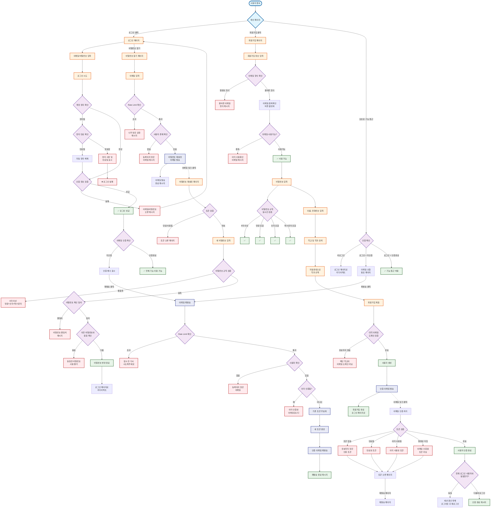

# 🔐 Unibook 사용자 인증 플로우차트

## 📊 전체 인증 흐름도

## 🔍 **주요 흐름 상세 설명**

### **1. 로그인 플로우** 🔑
로그인 시스템은 다음과 같은 단계로 구성됩니다:

1. **이메일/비밀번호 입력**
   - 유효한 이메일 형식 검증
   - 비밀번호 필드 입력

2. **계정 정지 상태 확인**
   - 정지된 계정인 경우 만료 시간 확인
   - 만료된 경우 자동으로 정지 해제
   - 유효한 정지인 경우 정지 사유와 만료일 표시

3. **인증 정보 검증**
   - Spring Security를 통한 이메일/비밀번호 검증
   - CustomUserDetailsService에서 사용자 정보 로드

4. **이메일 인증 여부 확인**
   - 미인증 사용자는 제한된 기능만 이용 가능
   - 인증 배너를 통해 재발송 유도

### **2. 회원가입 플로우** 📝
회원가입은 다음과 같은 검증 단계를 거칩니다:

1. **이메일 입력 및 중복 확인**
   - 실시간 이메일 형식 검증
   - AJAX를 통한 실시간 중복 확인
   - 이메일 변경 시 재확인 필요

2. **비밀번호 규칙 검증**
   - 8자 이상
   - 영문 포함
   - 숫자 포함
   - 특수문자 포함 (@$!%*#?&_)
   - 실시간으로 각 규칙 충족 여부 표시

3. **학교 및 학과 선택**
   - jQuery UI Autocomplete를 통한 검색
   - 학교-학과 연관 데이터 제공

4. **대학 이메일 도메인 검증**
   - 선택한 학교의 공식 이메일 도메인과 일치 여부 확인
   - 도메인 정보가 없는 학교는 일단 허용

5. **이메일 인증 메일 발송**
   - 비동기로 인증 메일 발송
   - 발송 실패해도 회원가입은 성공

### **3. 이메일 인증 플로우** ✉️
이메일 인증은 토큰 기반으로 처리됩니다:

1. **토큰 검증 단계**
   - 토큰 존재 여부 확인
   - 토큰 만료 시간 확인 (기본 24시간)
   - 토큰 사용 여부 확인
   - 토큰 타입 확인 (EMAIL_VERIFICATION)

2. **인증 완료 처리**
   - 사용자의 verified 필드를 true로 변경
   - 토큰을 사용됨으로 표시

3. **세션 처리**
   - 현재 로그인한 사용자와 동일한 경우 세션 갱신 필요
   - 로그아웃 후 재로그인 유도

### **4. 비밀번호 재설정 플로우** 🔒
비밀번호 재설정은 보안을 위해 다음 단계를 거칩니다:

1. **비밀번호 찾기 요청**
   - Rate Limiting으로 무차별 요청 방지
   - 등록된 이메일 확인

2. **재설정 토큰 발송**
   - PASSWORD_RESET 타입의 토큰 생성
   - 이메일로 재설정 링크 발송

3. **새 비밀번호 설정**
   - 토큰 유효성 검증
   - 비밀번호 규칙 준수 확인
   - 이전 비밀번호와 동일 여부 확인

### **5. 이메일 재발송 플로우** 🔄
이메일 재발송은 다음과 같이 처리됩니다:

1. **Rate Limiting 확인**
   - 너무 자주 요청하는 것을 방지
   - IP 또는 이메일 기반 제한

2. **사용자 상태 확인**
   - 등록된 사용자인지 확인
   - 이미 인증된 사용자인지 확인

3. **토큰 재생성**
   - 기존 미사용 토큰 무효화
   - 새로운 토큰 생성 및 발송

## 🛡️ **보안 및 예외 처리**

### **토큰 관련 예외**
- **만료된 토큰**: "만료되었거나 이미 사용된 토큰입니다" 메시지
- **사용된 토큰**: 동일한 에러 메시지로 정보 노출 방지
- **잘못된 토큰 타입**: "이메일 인증용 토큰이 아닙니다" 등

### **Rate Limiting**
- 이메일 재발송: 5분당 3회 제한
- 비밀번호 재설정: 시간당 5회 제한
- IP 기반 및 이메일 기반 이중 체크

### **계정 보안**
- 정지된 계정 로그인 차단
- 비밀번호 복잡성 강제
- 이전 비밀번호 재사용 방지
- CSRF 토큰 보호

## 📌 **구현 세부사항**

### **관련 컨트롤러**
- `AuthController`: 인증 관련 모든 엔드포인트 처리
- `VerificationController`: 인증 관련 페이지 렌더링

### **관련 서비스**
- `UserService`: 사용자 생성 및 관리
- `EmailService`: 이메일 발송 (비동기 처리)
- `RateLimitService`: Rate Limiting 처리

### **보안 설정**
- `SecurityConfig`: Spring Security 설정
- `CustomUserDetailsService`: 사용자 인증 정보 로드
- `CustomAuthenticationFailureHandler`: 로그인 실패 처리
- `VerificationInterceptor`: 미인증 사용자 접근 제한

### **데이터베이스 엔티티**
- `User`: 사용자 정보 (verified 필드 포함)
- `EmailVerificationToken`: 인증 토큰 정보
- `AdminAction`: 사용자 정지 정보

## 🎯 **핵심 기능 요약**

1. **완벽한 이메일 인증 시스템**
   - 토큰 기반 안전한 인증
   - 만료 및 재발송 처리

2. **강력한 보안 기능**
   - Rate Limiting
   - 계정 정지 시스템
   - 비밀번호 복잡성 검증

3. **사용자 친화적 UX**
   - 실시간 유효성 검증
   - 명확한 에러 메시지
   - 자동완성 기능

4. **대학 특화 기능**
   - 대학 이메일 도메인 검증
   - 학교-학과 연동 시스템