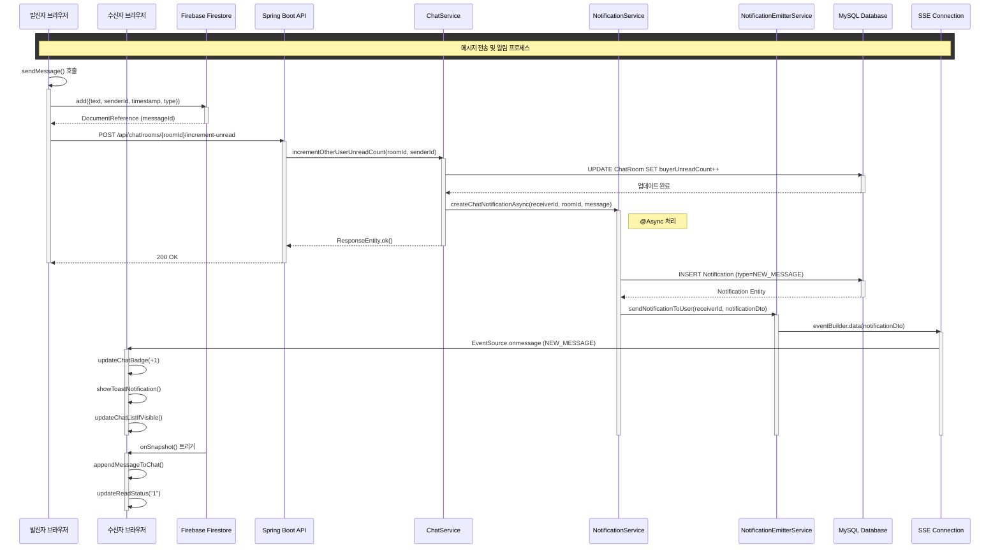
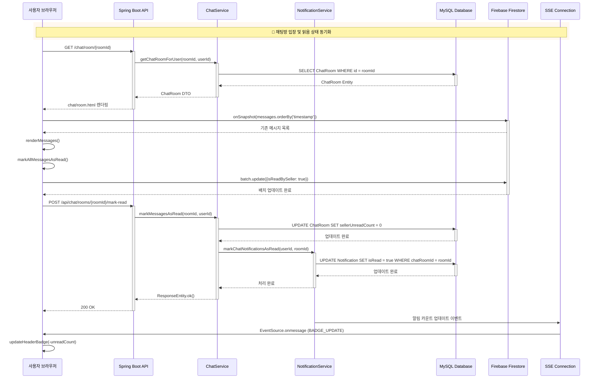
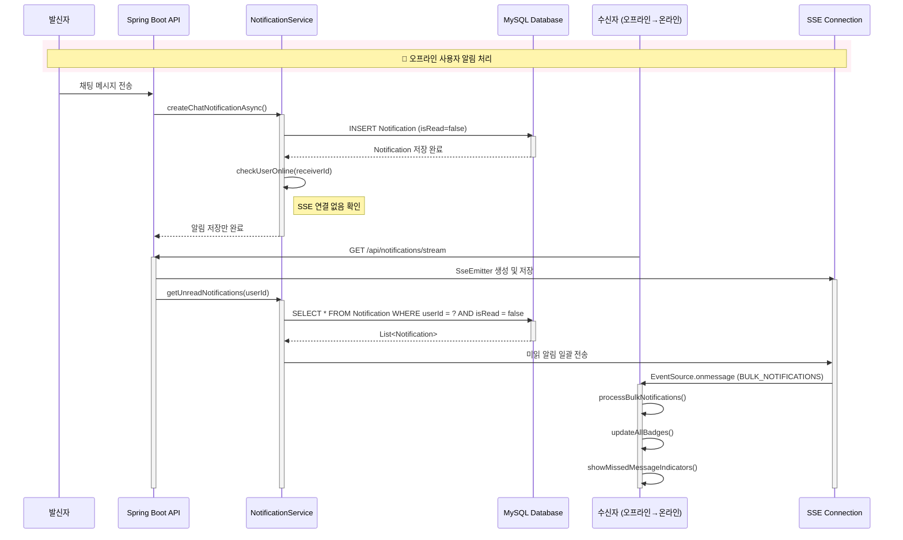
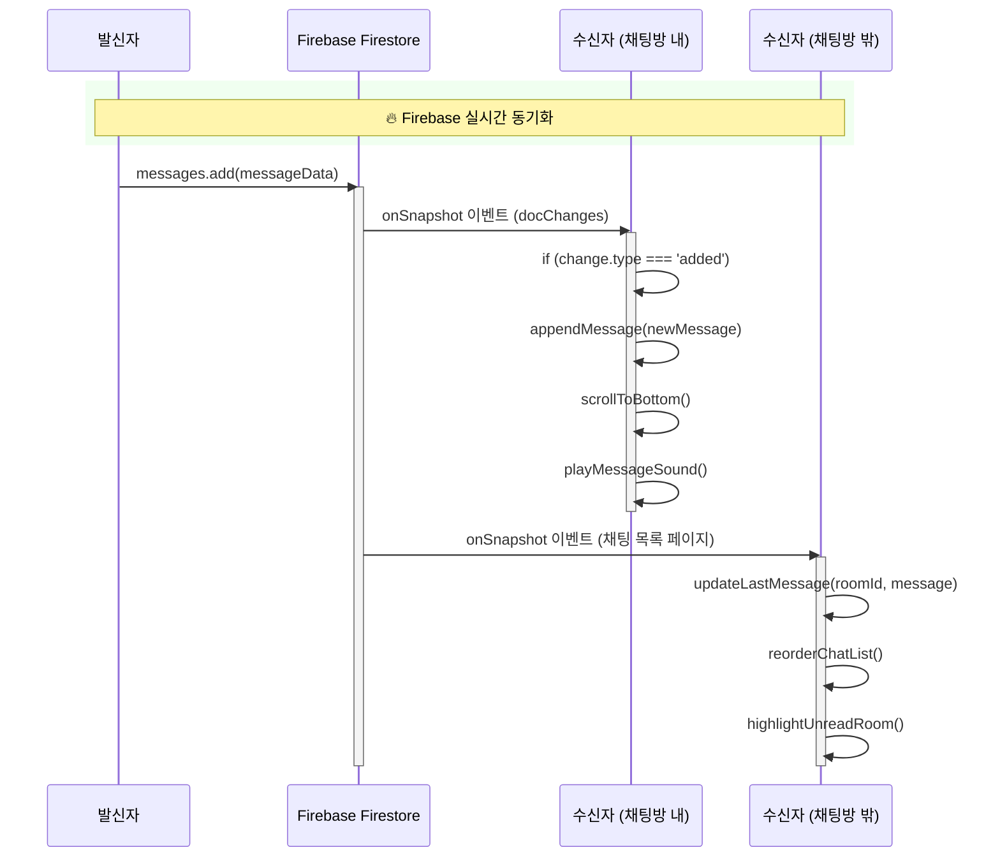

# Unibook 채팅 및 알림 시스템 Sequence Diagram

## 📊 시스템 개요
Unibook의 채팅 시스템은 Firebase Firestore를 통한 실시간 메시징과 Spring Boot SSE를 통한 알림을 결합한 하이브리드 아키텍처입니다. 이 문서는 메시지 전송부터 알림 수신까지의 전체 흐름을 상세히 도식화합니다.

## 🔄 주요 시나리오

### 1. 메시지 전송 및 알림 흐름



### 2. 채팅방 입장 및 읽음 상태 동기화



### 3. 오프라인 사용자 알림 처리



### 4. 실시간 메시지 수신 흐름 (Firebase)



## 🔧 기술적 세부사항

### 비동기 처리 구조
```
@Async("notificationTaskExecutor")
public void createChatNotificationAsync(Long receiverId, String roomId, String message) {
    // 1. Notification 엔티티 생성 및 저장
    // 2. NotificationDto 변환
    // 3. SSE를 통한 실시간 전송
}
```

### 3중 읽음 상태 관리
1. **Firebase Level**: `isReadByBuyer`, `isReadBySeller` (메시지별)
2. **Database Level**: `buyerUnreadCount`, `sellerUnreadCount` (채팅방별)
3. **Notification Level**: `isRead` (알림별)

### SSE 연결 관리
- 연결 타임아웃: 180초
- 재연결 메커니즘: exponential backoff (1s → 2s → 4s → 8s)
- 연결당 메모리: ~1KB
- 동시 연결 제한: 사용자당 최대 3개

### 성능 최적화
- Firebase batch update: 최대 500개 문서 동시 업데이트
- SSE 버퍼링: 100ms 디바운싱으로 알림 그룹화
- 알림 페이징: 최근 50개만 초기 로드
- 메시지 lazy loading: 스크롤 기반 추가 로드

## 📌 주요 엔드포인트

### Chat API
- `POST /api/chat/rooms/{roomId}/increment-unread` - 읽지 않음 카운트 증가
- `POST /api/chat/rooms/{roomId}/mark-read` - 메시지 읽음 처리
- `GET /api/chat/rooms` - 채팅방 목록 조회

### Notification API
- `GET /api/notifications/stream` - SSE 스트림 연결
- `GET /api/notifications/unread-count` - 읽지 않은 알림 수
- `POST /api/notifications/{id}/read` - 알림 읽음 처리

## 🎯 핵심 특징

1. **하이브리드 아키텍처**: Firebase (채팅) + SSE (알림) 결합
2. **실시간 동기화**: 메시지와 알림의 즉각적인 전달
3. **오프라인 지원**: 미읽 알림 저장 및 재전송
4. **확장성**: 비동기 처리와 효율적인 연결 관리
5. **일관성**: 3중 읽음 상태 관리로 데이터 정합성 보장