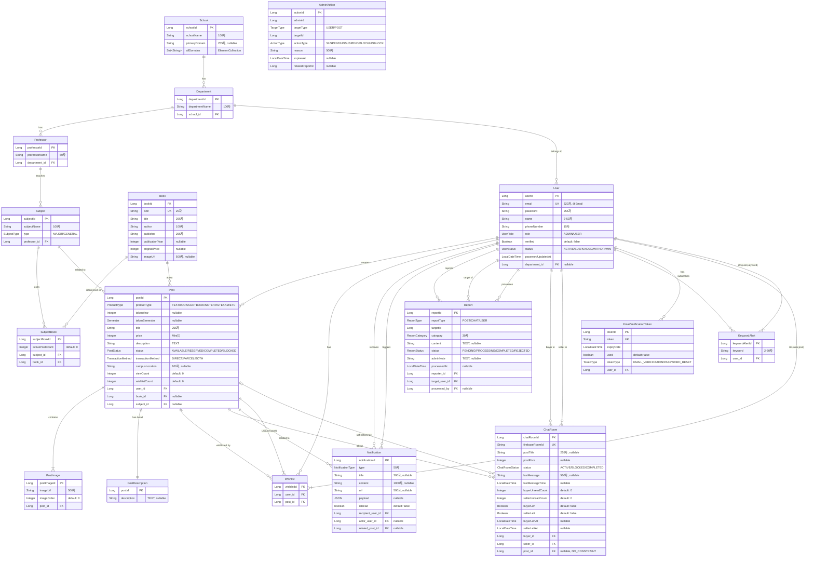

# 📊 Unibook Database ERD (Entity Relationship Diagram)

## 🎯 Overview
Unibook 프로젝트는 18개의 엔티티로 구성된 대학생 교재 거래 플랫폼입니다. 모든 엔티티는 BaseEntity를 상속받아 생성/수정 시간과 사용자 정보를 자동으로 추적합니다.

## 🗺️ Complete ERD Diagram

## 📁 Entity Details

### 🔄 BaseEntity (Abstract)
모든 엔티티가 상속받는 추상 클래스로, 감사(Audit) 기능을 제공합니다.

| Field | Type | Description |
|-------|------|-------------|
| createdAt | LocalDateTime | 생성 시간 (자동) |
| updatedAt | LocalDateTime | 수정 시간 (자동) |
| createdBy | Long | 생성자 ID |
| updatedBy | Long | 수정자 ID |

---

### 👤 User Entity
사용자 정보를 관리하는 핵심 엔티티입니다.

**Table:** `users`

**Indexes:**
- `idx_user_email` (email) - UNIQUE
- `idx_user_department` (department_id)

**Key Features:**
- 이메일 기반 인증 시스템
- 역할 기반 접근 제어 (ADMIN/USER)
- 사용자 상태 관리 (활성/정지/탈퇴)
- 학과 소속 정보

---

### 📝 Post Entity
게시글(교재 판매) 정보를 저장하는 엔티티입니다.

**Table:** `posts`

**Indexes:**
- `idx_post_created_at` (created_at)
- `idx_post_status` (status)
- `idx_post_user` (user_id)
- `idx_post_book` (book_id)
- `idx_post_status_created` (status, created_at) - 복합 인덱스

**Key Features:**
- 다양한 상품 타입 지원 (교재, 자격증책, 필기노트, 족보 등)
- 상태 관리 (판매중/예약중/판매완료/차단)
- 이미지 다중 업로드 (PostImage와 1:N)
- 상세 설명 분리 저장 (PostDescription과 1:1)
- 조회수 및 찜 횟수 추적

---

### 📚 Book Entity
책 정보를 저장하는 마스터 데이터 엔티티입니다.

**Table:** `books`

**Indexes:**
- `idx_book_isbn` (isbn) - ISBN 검색용
- `idx_book_title` (title) - 제목 검색용
- `idx_book_author` (author) - 저자 검색용
- `idx_book_created_at` (created_at)

**Key Features:**
- ISBN 기반 유니크 관리
- 네이버 책 API 연동 데이터
- 여러 과목에서 사용 가능 (SubjectBook를 통한 N:M)

---

### 🏫 Academic Structure (School → Department → Professor → Subject)
학교 체계를 표현하는 계층적 구조입니다.

#### School Entity
**Table:** `schools`
- 학교별 도메인 관리 (ElementCollection)
- 여러 학과 포함

#### Department Entity
**Table:** `departments`
- 학교 소속 (ManyToOne)
- 교수진 및 학생 관리

#### Professor Entity
**Table:** `professors`
- 학과 소속
- 담당 과목 관리

#### Subject Entity
**Table:** `subjects`
- 과목 유형 (전공/교양)
- 교수 배정
- 교재 연결 (SubjectBook)

---

### 💬 ChatRoom Entity
Firebase 기반 실시간 채팅방 정보입니다.

**Table:** `chat_rooms`

**Key Features:**
- Firebase Room ID로 실제 채팅 연동
- 읽지 않은 메시지 수 추적
- 채팅방 나가기 기능
- Post 삭제 후에도 정보 유지 (Soft Reference)

---

### ❤️ Wishlist Entity
찜하기 기능을 위한 엔티티입니다.

**Table:** `wishlists`

**Constraints:**
- UNIQUE(user_id, post_id) - 중복 찜 방지

**Indexes:**
- `idx_user_wishlist` (user_id)
- `idx_post_wishlist` (post_id)

---

### 🔔 Notification Entity
실시간 알림 시스템을 위한 엔티티입니다.

**Table:** `notifications`

**Indexes:**
- `idx_recipient_read` (recipient_user_id, is_read)
- `idx_recipient_created` (recipient_user_id, created_at)

**Key Features:**
- 다양한 알림 타입 지원
- JSON payload로 유연한 데이터 저장
- SSE(Server-Sent Events)와 연동

---

### 🚨 Report Entity
신고 시스템을 위한 엔티티입니다.

**Table:** `reports`

**Indexes:**
- `idx_report_status` (status)
- `idx_report_reporter` (reporter_id)
- `idx_report_target_user` (target_user_id)
- `idx_report_created` (created_at)
- `idx_report_type_target` (report_type, target_id)

**Key Features:**
- 게시글/채팅/사용자 신고 가능
- 신고 카테고리 분류
- 관리자 처리 상태 추적

---

### ⚖️ AdminAction Entity
관리자 조치 이력을 기록하는 엔티티입니다.

**Table:** `admin_actions`

**Indexes:**
- `idx_admin_target` (target_type, target_id)
- `idx_admin_expires` (expires_at)
- `idx_admin_user` (admin_id)

**Key Features:**
- 사용자 정지/게시글 차단 기록
- 조치 만료 시간 관리
- 신고와 연결 가능

---

### 🔍 KeywordAlert Entity
키워드 알림 구독을 위한 엔티티입니다.

**Table:** `keyword_alerts`

**Constraints:**
- UNIQUE(user_id, keyword)

**Indexes:**
- `idx_keyword_alert_user` (user_id)
- `idx_keyword_alert_keyword` (keyword)

---

### 🖼️ PostImage Entity
게시글 이미지를 저장하는 엔티티입니다.

**Table:** `post_images`

**Key Features:**
- 이미지 순서 관리
- Post 삭제 시 자동 삭제 (CASCADE)
- Firebase Storage URL 저장

---

### 📄 PostDescription Entity
게시글 상세 설명을 분리 저장하는 엔티티입니다.

**Table:** `post_descriptions`

**Key Features:**
- Post와 1:1 관계 (@MapsId)
- TEXT 타입으로 긴 설명 저장
- 성능 최적화를 위한 분리

---

### 📧 EmailVerificationToken Entity
이메일 인증 및 비밀번호 재설정 토큰 관리입니다.

**Table:** `email_verification_tokens`

**Key Features:**
- 토큰 유형 구분 (이메일 인증/비밀번호 재설정)
- 만료 시간 관리
- 사용 여부 추적
- User 삭제 시 자동 삭제 (CASCADE)

---

## 🎯 Design Highlights

### 1. **Performance Optimization**
- **Lazy Loading**: 모든 연관관계는 LAZY 로딩 사용
- **Batch Size**: PostImage, SubjectBook에 @BatchSize(10) 적용
- **Index Strategy**: 자주 조회되는 컬럼에 인덱스 적용
- **Separation**: PostDescription 분리로 목록 조회 성능 향상

### 2. **Data Integrity**
- **Cascade Operations**: 컴포지션 관계에만 CASCADE 적용
- **Soft Dependencies**: ChatRoom-Post 관계는 NO_CONSTRAINT
- **Unique Constraints**: 비즈니스 규칙 강제
- **Enum Types**: 타입 안정성 보장

### 3. **Scalability**
- **JSON Support**: Notification payload로 유연한 데이터 구조
- **Audit Trail**: BaseEntity로 모든 변경 이력 추적
- **Status Management**: 각 엔티티별 상태 관리
- **ElementCollection**: School domains 유연한 관리

### 4. **Business Rules**
- **One Wishlist per User-Post**: 중복 찜 방지
- **One Keyword Alert per User-Keyword**: 중복 키워드 방지
- **Soft Delete Pattern**: ChatRoom에서 Post 정보 유지
- **Time-based Actions**: AdminAction 만료 시간 관리

---

## 📊 Statistics

- **Total Entities**: 18 (including BaseEntity)
- **Total Tables**: 17
- **Total Relationships**: 30+
- **Total Indexes**: 25+
- **Enum Types**: 12

이 ERD는 대학생 교재 거래라는 도메인을 완벽하게 표현하며, 성능과 확장성을 고려한 설계를 보여줍니다.