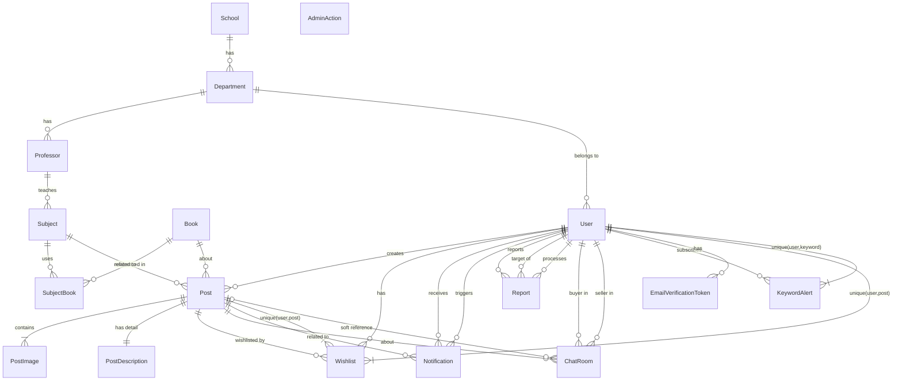

# 📊 Unibook Database ERD (Simplified)

## 🎯 Overview
Unibook 프로젝트의 18개 엔티티 간의 관계를 간소화하여 표현한 ERD입니다.

## 🗺️ Simplified ERD Diagram



## 📁 Entity Groups

### 🎯 Core Entities (핵심 엔티티)
- **User** - 사용자 정보
- **Post** - 게시글 (교재 판매)
- **Book** - 책 정보

### 🏫 Academic Structure (학교 구조)
- **School** - 학교
- **Department** - 학과
- **Professor** - 교수
- **Subject** - 과목
- **SubjectBook** - 과목별 교재

### 💬 Feature Entities (기능 엔티티)
- **ChatRoom** - 채팅방
- **Wishlist** - 찜 목록
- **Notification** - 알림

### ⚖️ Administrative Entities (관리 엔티티)
- **Report** - 신고
- **AdminAction** - 관리자 조치
- **KeywordAlert** - 키워드 알림

### 📎 Supporting Entities (보조 엔티티)
- **PostImage** - 게시글 이미지
- **PostDescription** - 게시글 상세 설명
- **EmailVerificationToken** - 이메일 인증 토큰

## 🔗 Key Relationships

### 계층 구조
```
School → Department → Professor → Subject → SubjectBook ← Book
                ↓
              User → Post
```

### 주요 연관관계
- **User**: 모든 기능의 중심 (Post, Wishlist, Notification, ChatRoom 등)
- **Post**: 거래의 중심 (PostImage, PostDescription, ChatRoom, Wishlist)
- **Academic Structure**: School부터 Book까지 연결된 학술 구조

### 특수 관계
- **Soft Reference**: ChatRoom ↔ Post (게시글 삭제 후에도 채팅방 유지)
- **Unique Constraints**: Wishlist, KeywordAlert (중복 방지)

## 📊 Summary
- **총 엔티티 수**: 18개
- **핵심 엔티티**: 3개 (User, Post, Book)
- **관계 유형**: 1:1, 1:N, N:M (through SubjectBook)
- **특수 패턴**: Soft Reference, Unique Constraints