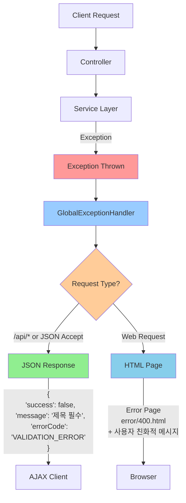
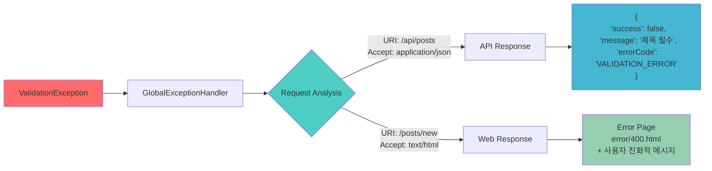
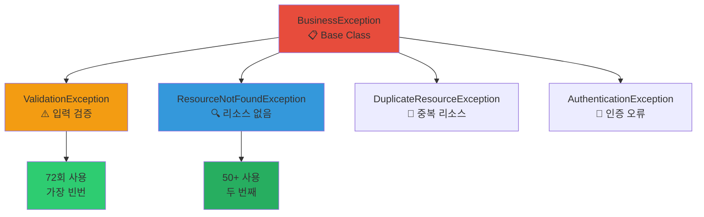
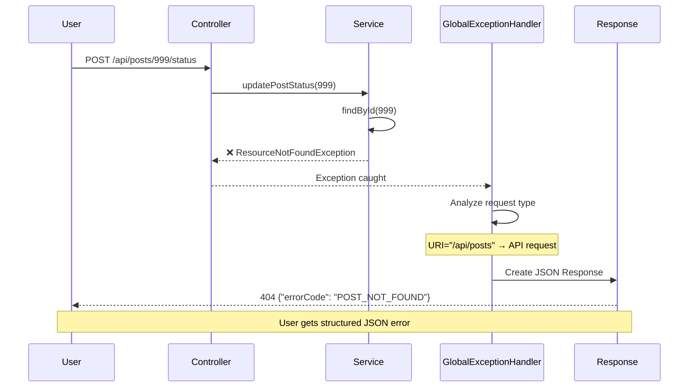
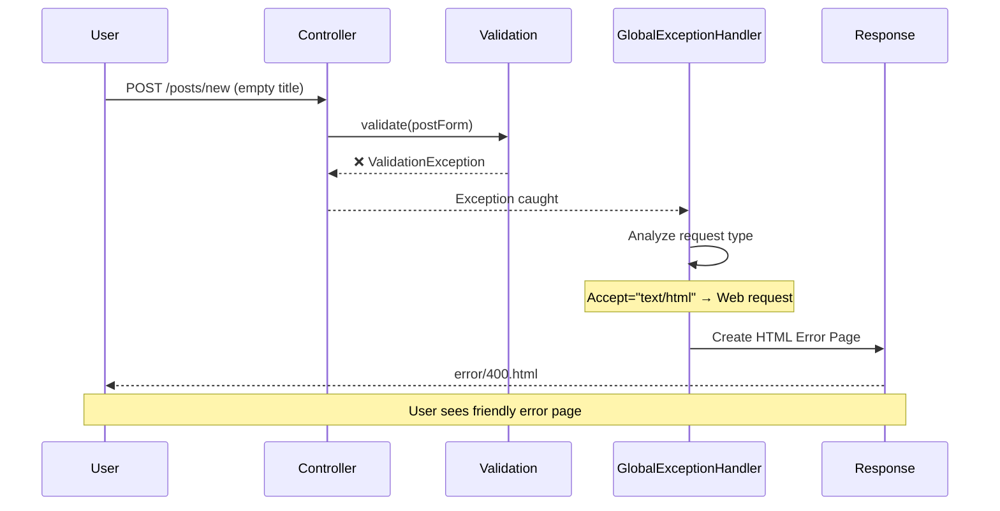

# 🛡️ Unibook Exception Handling Flow Diagram

## 🎯 Overview
Unibook 프로젝트의 하이브리드 아키텍처(MVC + RESTful API)에서 예외 처리가 어떻게 동작하는지 시각적으로 보여주는 다이어그램입니다.

## 🔄 Exception Handling Flow



## 🔀 Dual Response System



## 📊 Exception Hierarchy



## 🚀 Real-time Exception Flow Example

### 시나리오: 존재하지 않는 게시글 API 호출



### 시나리오: 웹 폼 검증 실패



## 🔧 Implementation Details

### Request Type Detection Logic

```java
private boolean isApiRequest(HttpServletRequest request) {
    String requestURI = request.getRequestURI();
    String acceptHeader = request.getHeader("Accept");
    
    return requestURI.startsWith("/api/") || 
           (acceptHeader != null && acceptHeader.contains("application/json"));
}
```

### Dual Response Creation

```java
private Object createResponse(ErrorCode errorCode, String message, 
                            HttpServletRequest request, HttpStatus status) {
    if (isApiRequest(request)) {
        // API Response
        return ResponseEntity.status(status)
            .body(ErrorResponse.of(errorCode, message));
    } else {
        // Web Response
        ModelAndView modelAndView = new ModelAndView("error/" + status.value());
        modelAndView.addObject("message", message);
        return modelAndView;
    }
}
```

## 📋 Exception Handler Examples

### ValidationException Handler

```java
@ExceptionHandler(ValidationException.class)
public Object handleValidationException(ValidationException ex, HttpServletRequest request) {
    log.warn("Validation error at {}: {}", request.getRequestURI(), ex.getMessage());
    
    if (isApiRequest(request)) {
        return ResponseEntity.badRequest()
            .body(ErrorResponse.of(ex.getErrorCode(), ex.getMessage()));
    } else {
        ModelAndView modelAndView = new ModelAndView("error/400");
        modelAndView.addObject("message", ex.getMessage());
        return modelAndView;
    }
}
```

### ResourceNotFoundException Handler

```java
@ExceptionHandler(ResourceNotFoundException.class)
public Object handleResourceNotFoundException(ResourceNotFoundException ex, HttpServletRequest request) {
    log.warn("Resource not found at {}: {}", request.getRequestURI(), ex.getMessage());
    
    return createResponse(ex.getErrorCode(), ex.getMessage(), request, HttpStatus.NOT_FOUND);
}
```

## 🎯 Key Benefits

### 1. **Automatic Request Type Detection**
- No need for developers to handle different response types manually
- Smart detection based on URI patterns and Accept headers

### 2. **Centralized Exception Handling**
- All exceptions handled in one place (GlobalExceptionHandler)
- Consistent error response format across the application

### 3. **Dual Response Support**
- API clients get structured JSON responses
- Web browsers get user-friendly HTML error pages

### 4. **Maintainable Code**
- Single exception handler supports both MVC and REST patterns
- Easy to add new exception types and handlers

## 📊 Response Examples

### API Request Response
```json
{
    "success": false,
    "errorCode": "POST_NOT_FOUND",
    "message": "게시글을 찾을 수 없습니다.",
    "timestamp": "2025-01-10T10:30:00",
    "path": "/api/posts/999"
}
```

### Web Request Response
```html
<!DOCTYPE html>
<html>
<head>
    <title>오류 - Unibook</title>
</head>
<body>
    <div class="error-container">
        <h1>🚫 오류가 발생했습니다</h1>
        <p>게시글을 찾을 수 없습니다.</p>
        <a href="/posts" class="btn btn-primary">게시글 목록으로 돌아가기</a>
    </div>
</body>
</html>
```

## 💡 Why This Architecture?

### Problem Statement
```
Traditional MVC: Exception → HTML Error Page only
RESTful API: Exception → JSON Error Response only

Hybrid Architecture: Need to support BOTH
```

### Our Solution
```
Smart Request Analysis → Appropriate Response Type
- API requests → JSON responses
- Web requests → HTML pages
- Single codebase → Multiple client support
```

### Business Value
- **Better User Experience**: Appropriate error format for each client type
- **Developer Efficiency**: One exception handler for all scenarios
- **Future-Proof**: Easy to add mobile app support
- **Maintainable**: Centralized error handling logic

---

이 Exception Handling Flow는 Unibook의 하이브리드 아키텍처에서 발생하는 복잡한 예외 처리 요구사항을 우아하게 해결하는 창의적이고 실용적인 접근법을 보여줍니다.