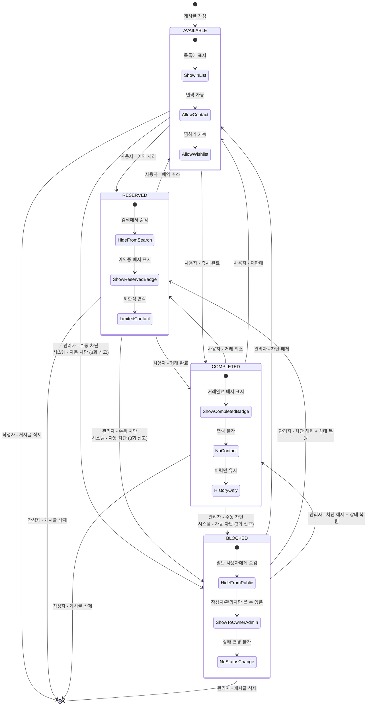

# 📊 Unibook Post Lifecycle State Diagram

## 🎯 Overview
Unibook 게시글(Post)의 전체 라이프사이클과 상태 전이를 상세히 분석한 다이어그램입니다. 사용자 권한, 자동 차단 메커니즘, 관리자 권한 등 모든 비즈니스 로직을 포함합니다.

## 🔄 Complete Post Lifecycle State Diagram



## 📋 State Descriptions

### 🟢 AVAILABLE (판매중)
- **기본 상태**: 게시글 작성 시 초기 상태
- **표시**: 목록에 노출, 검색 가능
- **기능**: 연락하기, 찜하기, 채팅 가능
- **배지**: 없음 (기본 상태)

### 🟡 RESERVED (예약중)  
- **의미**: 구매자와 거래 진행 중
- **표시**: 검색 결과에서 우선순위 낮음
- **기능**: 제한적 연락, 찜하기 가능
- **배지**: "예약중" 노란색 배지

### ⚪ COMPLETED (거래완료)
- **의미**: 거래가 성공적으로 완료됨
- **표시**: 완료된 게시글로 표시
- **기능**: 연락하기 불가, 찜하기 불가
- **배지**: "거래완료" 회색 배지

### 🔴 BLOCKED (차단됨)
- **의미**: 관리자에 의해 차단되거나 자동 차단됨
- **표시**: 일반 사용자에게 숨김
- **기능**: 모든 상호작용 차단
- **배지**: "차단됨" 빨간색 배지 (관리자/작성자에게만)

## 🔐 Permission Matrix

| 상태 | 작성자 | 일반 사용자 | 관리자 |
|------|--------|-------------|--------|
| **AVAILABLE** | 모든 기능 | 보기, 연락, 찜 | 모든 기능 + 차단 |
| **RESERVED** | 상태변경, 수정 | 보기, 제한적 연락 | 모든 기능 + 차단 |
| **COMPLETED** | 상태변경, 삭제 | 보기만 가능 | 모든 기능 + 차단 |
| **BLOCKED** | 보기만 가능 | 숨김 | 모든 기능 + 차단해제 |

## 🚨 Automatic Blocking Mechanism

### 자동 차단 조건
```java
// ReportService.checkAutoBlind()
if (uniqueReporterCount >= AUTO_BLIND_THRESHOLD) {  // 3회
    post.setStatus(PostStatus.BLOCKED);
    // 자동 차단 알림 발송
}
```

### 자동 차단 특징
- **임계치**: 서로 다른 사용자 3명이 신고
- **즉시 처리**: 3번째 신고와 동시에 자동 차단
- **알림 발송**: 작성자에게 차단 알림
- **관리자 검토**: 관리자 대시보드에서 확인 가능

## 🔄 State Transition Rules

### 1. **사용자 권한 상태 변경**
```java
// PostController.updatePostStatus()
AVAILABLE ↔ RESERVED ↔ COMPLETED (자유로운 변경)
```
- 작성자만 변경 가능
- 3회 이상 신고된 게시글은 변경 불가
- BLOCKED 상태는 변경 불가

### 2. **관리자 권한 상태 변경**
```java
// AdminController 
Any State → BLOCKED (관리자 차단)
BLOCKED → Any State (관리자 차단 해제)
```

### 3. **시스템 자동 변경**
```java
// 자동 차단
if (reportCount >= 3) {
    status = BLOCKED;
}
```

## 🔔 Notification Integration

### 상태 변경 시 알림 발송
```java
// NotificationService.publishWishlistStatusChangeNotifications()
- AVAILABLE → RESERVED: "찜한 상품이 예약되었습니다"
- RESERVED → COMPLETED: "찜한 상품이 거래완료되었습니다"  
- Any → BLOCKED: "찜한 상품이 차단되었습니다"
```

### 알림 대상
- **찜한 사용자들**: 상태 변경 시 실시간 알림
- **키워드 구독자**: 새 게시글 등록 시 알림
- **작성자**: 차단/신고 시 알림

## 💾 Database Implementation

### PostStatus Enum
```java
public enum PostStatus {
    AVAILABLE("판매중"),
    RESERVED("예약중"), 
    COMPLETED("거래완료"),
    BLOCKED("차단됨")
}
```

### 상태 변경 로깅
```sql
-- AdminAction 테이블에 기록
INSERT INTO admin_actions (
    admin_id, target_type, target_id, 
    action_type, reason, created_at
);
```

## 🛡️ Security & Validation

### 권한 검증
```java
// AuthorizationService
- requireCanEdit(): 수정 권한 체크
- requireOwnerOrAdmin(): 소유자/관리자 권한 체크
- isBlocked(): 차단 상태 확인
```

### 상태 변경 제약
1. **신고 수 체크**: 3회 이상 신고 시 상태 변경 불가
2. **차단 상태 체크**: BLOCKED 게시글은 관리자만 변경 가능
3. **소유권 확인**: 작성자 또는 관리자만 변경 가능

## 🔍 Edge Cases & Error Handling

### 1. **동시성 문제**
- **문제**: 여러 사용자가 동시에 상태 변경
- **해결**: JPA Optimistic Locking으로 충돌 방지

### 2. **차단된 게시글 접근**
- **문제**: BLOCKED 게시글 직접 URL 접근
- **해결**: Controller에서 권한 체크 후 403 반환

### 3. **삭제된 게시글 참조**
- **문제**: 채팅방에서 삭제된 게시글 참조
- **해결**: ChatRoom에서 Soft Reference 사용

### 4. **신고 수 조작 방지**
- **문제**: 동일 사용자 중복 신고
- **해결**: DB에서 UNIQUE(reporter_id, target_id) 제약

## 📊 State Transition Statistics

### 일반적인 게시글 흐름
1. **AVAILABLE (80%)**: 대부분의 게시글이 머무는 상태
2. **RESERVED (15%)**: 거래 진행 중인 게시글
3. **COMPLETED (4%)**: 성공적으로 거래 완료
4. **BLOCKED (1%)**: 신고 또는 관리자 차단

### 상태 전이 패턴
- **AVAILABLE → RESERVED**: 가장 빈번한 전이
- **RESERVED → COMPLETED**: 성공적인 거래 완료
- **COMPLETED → AVAILABLE**: 드물게 재판매
- **Any → BLOCKED**: 신고 누적 또는 관리자 조치

## 🚀 Future Enhancements

### 1. **추가 상태 고려**
- **PENDING**: 승인 대기 (신규 사용자)
- **EXPIRED**: 일정 기간 후 자동 만료
- **ARCHIVED**: 오래된 게시글 아카이브

### 2. **자동화 개선**
- **ML 기반 차단**: 부적절한 내용 자동 감지
- **가격 추천**: 시세 기반 가격 제안
- **상태 예측**: 거래 성공 확률 예측

### 3. **알림 고도화**
- **단계별 알림**: 상태별 맞춤 알림
- **푸시 알림**: 모바일 앱 연동
- **이메일 알림**: 중요 상태 변경 시

## 💡 Business Value

### 1. **거래 안전성**
- 자동 차단으로 부적절한 게시글 제거
- 신고 시스템으로 커뮤니티 자정
- 관리자 도구로 빠른 대응

### 2. **사용자 경험**
- 명확한 상태 표시로 혼란 방지
- 실시간 알림으로 정보 제공
- 유연한 상태 변경으로 편의성 증대

### 3. **운영 효율성**
- 자동화된 관리로 인력 절약
- 체계적인 로깅으로 추적 가능
- 통계 데이터로 서비스 개선

---

이 Post Lifecycle State Diagram은 Unibook 플랫폼의 핵심 비즈니스 로직을 완전히 문서화하여, 개발자와 이해관계자들이 게시글 관리 시스템의 복잡성과 안전장치를 이해할 수 있도록 합니다.