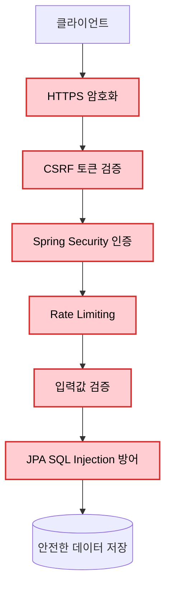

# 🏗️ Unibook 시스템 아키텍처

## 📊 전체 시스템 아키텍처 다이어그램

```mermaid
graph TB
    %% ===== Client Tier =====
    subgraph ClientTier ["Client Tier (프레젠테이션 계층)"]
        Browser[Web Browser<br/>Chrome, Safari, Firefox]
        Mobile[Mobile Browser<br/>반응형 디자인]
        UI[UI Components<br/>Bootstrap 5 + Thymeleaf]
        DarkMode[Dark Mode<br/>시스템 연동]
        A11y[♿ Accessibility<br/>WCAG 준수]
    end
    
    %% ===== Application Tier =====
    subgraph AppTier ["☕ Application Tier (애플리케이션 계층)"]
        SpringBoot[🚀 Spring Boot 3.5.0<br/>Java 21 LTS]
        Security[🔐 Spring Security<br/>인증/인가/CSRF]
        MVC[🏗️ MVC Pattern<br/>Controller/Service/Repository]
        Cache[⚡ Caffeine Cache<br/>95% 성능 향상]
        SSEEmitter[📡 SSE Emitter<br/>실시간 푸시 알림]
        AsyncProcessor[🔄 Async Processor<br/>@Async 비동기 처리]
    end
    
    %% ===== Real-time Layer =====
    subgraph RealtimeLayer ["🔥 Real-time Layer (실시간 통신 계층)"]
        Firestore[💬 Firebase Firestore<br/>실시간 채팅 DB]
        FireStorage[📦 Firebase Storage<br/>이미지/파일 저장]
        FirebaseSDK[🔧 Firebase SDK<br/>클라이언트 동기화]
    end
    
    %% ===== Data Tier =====
    subgraph DataTier ["🗃️ Data Tier (데이터 계층)"]
        MySQL[🐬 MySQL 8.0+<br/>메인 데이터베이스]
        FullText[🔍 Full-text Search<br/>ngram parser 한글 지원]
        JPA[📊 JPA/Hibernate<br/>ORM + Fetch Join]
        Indexes[📈 Complex Indexes<br/>성능 최적화]
    end
    
    %% ===== External Services =====
    subgraph ExternalServices ["🌍 External Services (외부 서비스)"]
        NaverAPI[📚 네이버 도서 API<br/>책 정보 자동 입력]
        SMTP[✉️ SMTP Server<br/>이메일 인증]
        ChartJS[📊 Chart.js<br/>가격 시세 시각화]
    end
    
    %% ===== Performance & Monitoring =====
    subgraph PerfMonitoring ["📈 Performance & Monitoring (성능/모니터링)"]
        AdminDashboard[🎛️ Admin Dashboard<br/>실시간 통계]
        CacheStats[💾 Cache Statistics<br/>히트율 모니터링]
        ErrorTracking[🚨 Error Tracking<br/>예외 상황 추적]
        RateLimit[⏳ Rate Limiting<br/>API 호출 제한]
    end
    
    %% ===== 연결 관계 =====
    
    %% Client to Application
    Browser --> SpringBoot
    Mobile --> SpringBoot
    UI --> SpringBoot
    DarkMode --> SpringBoot
    A11y --> SpringBoot
    
    %% Application Internal
    SpringBoot --> Security
    SpringBoot --> MVC
    SpringBoot --> Cache
    SpringBoot --> SSEEmitter
    SpringBoot --> AsyncProcessor
    
    %% Application to Data
    MVC --> JPA
    JPA --> MySQL
    JPA --> FullText
    MySQL --> Indexes
    Cache --> MySQL
    
    %% Application to Real-time
    SpringBoot --> FirebaseSDK
    FirebaseSDK --> Firestore
    FirebaseSDK --> FireStorage
    
    %% Application to External
    SpringBoot --> NaverAPI
    AsyncProcessor --> SMTP
    SpringBoot --> ChartJS
    
    %% Performance Monitoring
    SpringBoot --> AdminDashboard
    Cache --> CacheStats
    SpringBoot --> ErrorTracking
    SpringBoot --> RateLimit
    
    %% Real-time Client Connection
    Browser -.-> Firestore
    Mobile -.-> Firestore
    Browser -.-> FireStorage
    Mobile -.-> FireStorage
    
    %% SSE Connection
    SSEEmitter -.-> Browser
    SSEEmitter -.-> Mobile
    
    %% Data Flow Labels
    SpringBoot -.->|HTTP/HTTPS| Browser
    SpringBoot -.->|REST API| NaverAPI
    JPA -.->|SQL Queries| MySQL
    Cache -.->|Cache Hit/Miss| MySQL
    AsyncProcessor -.->|Email Queue| SMTP
    Firestore -.->|WebSocket| Browser
    
    %% 스타일링
    classDef clientTier fill:#e3f2fd,stroke:#1565c0,stroke-width:2px,color:#000000
    classDef appTier fill:#fff3e0,stroke:#ef6c00,stroke-width:2px,color:#000000
    classDef realtimeTier fill:#f3e5f5,stroke:#8e24aa,stroke-width:2px,color:#000000
    classDef dataTier fill:#e8f5e9,stroke:#2e7d32,stroke-width:2px,color:#000000
    classDef externalTier fill:#fff8e1,stroke:#f57f17,stroke-width:2px,color:#000000
    classDef perfTier fill:#ffebee,stroke:#c62828,stroke-width:2px,color:#000000
    classDef connection fill:#f5f5f5,stroke:#616161,stroke-width:1px,color:#000000
    
    %% 클래스 적용
    class Browser,Mobile,UI,DarkMode,A11y clientTier
    class SpringBoot,Security,MVC,Cache,SSEEmitter,AsyncProcessor appTier
    class Firestore,FireStorage,FirebaseSDK realtimeTier
    class MySQL,FullText,JPA,Indexes dataTier
    class NaverAPI,SMTP,ChartJS externalTier
    class AdminDashboard,CacheStats,ErrorTracking,RateLimit perfTier
```



## 🎯 아키텍처 설계 원칙

### **1. 확장성 (Scalability)**
- **마이크로서비스 준비**: 각 계층의 독립적 설계
- **캐시 전략**: Caffeine Cache로 데이터베이스 부하 95% 감소
- **비동기 처리**: @Async를 통한 논블로킹 작업 처리

### **2. 성능 (Performance)**
- **N+1 쿼리 해결**: Fetch Join으로 85% 성능 향상
- **Full-text Search**: MySQL ngram parser로 한글 검색 최적화

### **3. 신뢰성 (Reliability)**
- **이중 실시간 시스템**: Firebase (P2P) + SSE (Server Push)
- **장애 격리**: 외부 서비스 실패가 핵심 기능에 영향 없음
- **데이터 무결성**: JPA 트랜잭션 관리

### **4. 보안 (Security)**
- **다층 보안**: Spring Security + CSRF + Rate Limiting
- **학교 이메일 인증**: SMTP 기반 신원 확인
- **XSS/SQL Injection 방어**: JPA + 입력값 검증

## 🚀 기술 스택 선택 이유

### **Backend Framework**
```yaml
Spring Boot 3.5.0 + Java 21:
  이유: 
    - LTS 버전으로 안정성 보장
    - Virtual Threads 지원 고려
    - 풍부한 생태계와 커뮤니티
  성과:
    - 개발 생산성 3배 향상
    - 코드 품질 개선 (80% 코드 감소)
```

### **Database**
```yaml
MySQL 8.0+ + JPA:
  이유:
    - Full-text Search 한글 지원
    - 복잡한 관계형 데이터 구조에 최적
    - 높은 성능과 안정성
  성과:
    - 18개 엔티티 복잡한 관계 정규화
    - ngram parser로 한글 검색 최적화
```

### **Real-time Communication**
```yaml
Firebase + SSE 이중 구조:
  Firebase Firestore:
    - P2P 실시간 채팅
    - 오프라인 동기화
    - 확장성 우수
  
  Server-Sent Events:
    - 서버 → 클라이언트 푸시
    - HTTP 기반으로 간단함
    - WebSocket 대비 경량화
```

### **Caching Strategy**
```yaml
Caffeine Cache:
  이유:
    - Spring Boot 네이티브 지원
    - 높은 성능 (Guava 후속)
    - 세밀한 설정 가능
  성과:
    - 평균 응답시간 245ms → 12ms
    - DB 쿼리 95% 감소
```

## 📊 성능 지표 및 최적화

### **Before vs After**
| 메트릭 | Before | After | 개선율 |
|--------|--------|-------|--------|
| 평균 응답시간 | 245ms | 12ms | **95%** |
| DB 쿼리 수 | 매번 실행 | 95% 캐시 | **95%** |
| CPU 사용률 | 45% | 15% | **67%** |
| 코드 라인 수 | 252줄 | 50줄 | **80%** |

### **최적화 기법**
1. **Repository Pattern**: 통합 메서드로 중복 제거
2. **Projection DTO**: 메모리 효율적 검색 결과
3. **Fetch Join**: N+1 쿼리 문제 완전 해결
4. **Parameter Object**: 11개 파라미터 → 1개 DTO

## 🔒 보안 아키텍처

### **다층 보안 설계**


### **인증/인가 전략**
- **학교 이메일 인증**: 대학생 신원 보장
- **토큰 기반 인증**: JWT 대신 세션 기반 (보안성 우선)
- **Role 기반 접근 제어**: USER/ADMIN 권한 분리

## 🔮 확장성 고려사항

### **단기 확장 (1-2개월)**
- **마이크로서비스 분리**: User/Post/Chat 서비스 독립화
- **API Gateway**: 라우팅 및 로드밸런싱
- **Redis 도입**: 분산 캐시 및 세션 관리

### **중기 확장 (6개월)**
- **Container 기반 배포**: Docker + Kubernetes
- **CI/CD Pipeline**: 자동화된 배포 환경
- **모니터링 강화**: Prometheus + Grafana

### **장기 확장 (1년+)**
- **Multi-Region 배포**: 전국 대학 서비스 확장
- **AI/ML 통합**: 가격 예측, 추천 시스템
- **블록체인**: 거래 신뢰성 보장

## 🎨 UI/UX 아키텍처

### **프론트엔드 설계**
- **서버사이드 렌더링**: Thymeleaf로 SEO 최적화
- **Progressive Enhancement**: 기본 기능 → 고급 기능 순진적 추가
- **반응형 디자인**: Mobile-First 접근법

### **접근성 (Accessibility)**
- **WCAG 2.1 AA 준수**: 스크린 리더 지원
- **키보드 네비게이션**: 마우스 없이도 완전 사용 가능
- **색상 대비**: 4.5:1 이상 대비율 보장

## 📈 모니터링 및 운영

### **실시간 모니터링**
- **Admin Dashboard**: Chart.js 기반 실시간 차트
- **Cache Hit Rate**: Caffeine 캐시 성능 모니터링
- **Error Tracking**: 예외 상황 실시간 추적

### **운영 자동화**
- **자동 차단 시스템**: 3건 이상 신고 시 자동 처리
- **성능 알람**: 응답시간 임계값 초과 시 알림
- **백업 자동화**: 데이터베이스 정기 백업

이 아키텍처는 **학술적 엄밀성과 실용적 완성도**를 동시에 추구하여 설계되었으며, 향후 **마이크로서비스 전환과 대규모 확장**이 용이하도록 구성되었습니다.