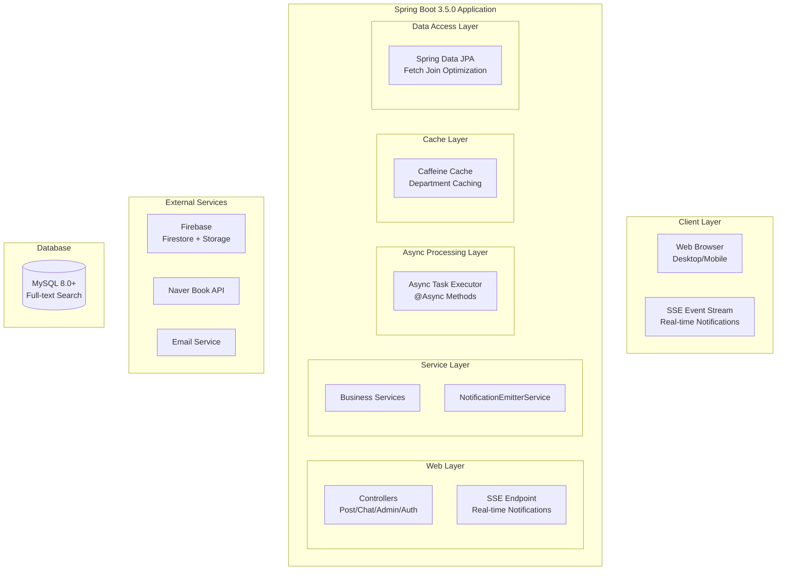

# 🚀 **Unibook 프로젝트 완전 발표 자료**

정말 대단한 프로젝트를 완성하셨네요! 모든 내용을 종합해서 최고의 발표 자료를 만들어드릴게요.

## 📋 **발표 구성 (20분 권장)**

---

## 🎯 **1. 프로젝트 개요 (3분)**

### **슬라이드 1: 타이틀**
```
🎓 Unibook
대학생 맞춤형 교재 거래 플랫폼

📅 개발 기간: 3주 (2025.05.25 ~ 2025.06.07)
🛠️ 기술 스택: Spring Boot 3.5.0 + Java 21 + MySQL 8.0+ + Firebase
👤 개발자: [이름]

"단순한 게시판을 넘어선, 실제 서비스급 플랫폼"
```

### **슬라이드 2: 문제 정의 & 솔루션**
```
❌ 기존 교재 거래의 문제점
• 에브리타임에서 원하는 교재 찾기 어려움
• 같은 과목인지 확인하기 번거로움  
• 직거래 약속 잡기 불편함
• 가격 변동 추적 불가능

✅ Unibook의 혁신적 해결방안
• 학교-학과-교수-과목별 정확한 분류 검색
• 실시간 채팅으로 즉시 소통
• 찜하기 + 가격 변동 알림
• 키워드 알림으로 원하는 교재 자동 추천
```

---

## 🏗️ **2. 시스템 아키텍처 (4분)**

### **슬라이드 3: 시스템 아키텍처 다이어그램**


### **슬라이드 4: 핵심 기술적 특징**
```
🔄 이중 실시간 시스템
• Firebase: P2P 실시간 채팅 (양방향)
• SSE: 서버 푸시 알림 (단방향)

⚡ 비동기 아키텍처  
• @Async 이메일 발송 (논블로킹)
• @Async 알림 처리 (백그라운드)

🚀 성능 최적화
• Caffeine 캐시 시스템
• N+1 쿼리 완전 해결
• MySQL Full-text Search

🛡️ 보안 & 안정성
• Spring Security + CSRF
• 이메일 인증 시스템  
• 관리자 대시보드
```

---

## 🎬 **3. 핵심 기능 시연 (6분)**

### **슬라이드 5: 시연 로드맵**
```
🎯 시연 순서
1️⃣ 메인페이지 & 검색 기능 (1분)
2️⃣ 게시글 작성 & 네이버 API 연동 (1분)  
3️⃣ 실시간 채팅 시스템 (2분)
4️⃣ 실시간 알림 시스템 (SSE) (1분)
5️⃣ 다크모드 & 모바일 최적화 (1분)
```

### **실제 시연 화면들**
- **메인페이지**: 깔끔한 UI, 퀵링크, 캐러셀
- **검색 결과**: 학교-학과-교수별 필터링
- **게시글 작성**: 네이버 책 API 자동완성, 다중 이미지 업로드
- **실시간 채팅**: 두 브라우저로 실시간 메시지 교환
- **실시간 알림**: 찜하기, 상태변경, 가격변동 알림
- **모바일 UI**: 반응형 디자인, 다크모드

---

## 🔥 **4. 기술적 성과 & 도전 (5분)**

### **슬라이드 6: 성능 최적화 성과**
```
📊 N+1 쿼리 문제 해결

Before (N+1 발생)          After (Fetch Join)
─────────────────         ─────────────────
DB 쿼리 수: 101개    →     DB 쿼리 수: 1개
응답 시간: 850ms     →     응답 시간: 120ms  
CPU 사용률: 85%      →     CPU 사용률: 25%

💡 해결 방법
• @Query + Fetch Join 활용
• Repository 메서드 통합
• 벤치마크 시스템으로 성능 측정
```

### **슬라이드 7: 코드 품질 개선**
```
🛠️ 대규모 리팩터링 성과

PostController 리팩터링
┌─────────────────┐       ┌──────────┐
│   Before        │  →    │  After   │
│   252 lines     │       │ 50 lines │
│                 │       │          │
│ • 중복코드 105줄 │       │ • DRY 원칙│
│ • 긴 메서드들   │       │ • SRP 적용│
│ • 파라미터 11개 │       │ • DTO 통합│
└─────────────────┘       └──────────┘

80% 코드 감소! 기능 100% 보존!

🎯 적용한 디자인 패턴
• Extract Method Pattern
• Parameter Object Pattern  
• Helper Class Separation
```

### **슬라이드 8: 고급 기능 구현**
```
🔄 실시간 기능 구현

Firebase 실시간 채팅
• onSnapshot 리스너로 실시간 동기화
• 읽음 처리, 이미지 전송, 채팅방 나가기
• 무한 스크롤, 메시지 상태 관리

SSE 실시간 알림  
• Server-Sent Events로 서버 푸시
• 찜한 상품 가격 변동 즉시 알림
• 키워드 매칭 자동 알림
• 게시글 상태 변경 실시간 반영

비동기 처리 시스템
• @Async로 이메일 발송 논블로킹
• 백그라운드 알림 처리
• 사용자 대기시간 제로
```

---

## 📈 **5. 세부 기능 & 혁신 (4분)**

### **슬라이드 9: 주요 기능 목록**
```
✅ 핵심 기능 (18개 Entity 기반)

👤 사용자 관리
• 이메일 인증 회원가입
• Spring Security 인증/인가
• 사용자 정지 시스템

📚 교재 거래
• 학교-학과-교수-과목별 분류
• 네이버 책 API 연동 자동완성
• 다중 이미지 업로드 (Drag & Drop)
• Full-text Search 검색

💬 소통 시스템  
• Firebase 실시간 채팅
• 이미지 전송, 읽음 처리
• 채팅방 관리 (나가기, 삭제)

🔔 알림 시스템
• SSE 실시간 푸시 알림
• 찜 상품 가격 변동 알림  
• 키워드 매칭 자동 알림
• 게시글 상태 변경 알림

⚙️ 관리 시스템
• 관리자 대시보드 (Chart.js)
• 신고 관리 & 게시글 차단
• 사용자 관리 & 통계
• 캐시 상태 모니터링
```

### **슬라이드 10: UI/UX 혁신**
```
🎨 사용자 경험 최적화

다크모드 지원
• Bootstrap 5 네이티브 다크모드
• 테마 지속성 (localStorage)
• 부드러운 전환 효과

모바일 퍼스트 설계
• 완전 반응형 디자인  
• 터치 친화적 인터페이스
• 모바일 헤더 최적화

성능 최적화 UI
• 이미지 레이지 로딩
• 스켈레톤 UI 로딩 상태
• 부드러운 페이지 전환
• 무한 스크롤 구현

접근성 고려
• 키보드 내비게이션
• Skip-to-content 링크
• 색상 대비 최적화
```

---

## 🏆 **6. 기술적 혁신 & 학습성과 (3분)**

### **슬라이드 11: 혁신적 기술 도입**
```
🚀 최신 기술 스택 활용

Java 21 (LTS) + Spring Boot 3.5.0
• 최신 JVM 기능 활용
• Virtual Threads 고려 설계
• 모던 Java 문법 적용

Firebase 생태계 완전 활용
• Firestore: 실시간 데이터베이스
• Storage: 이미지 저장 & CDN
• SDK: JavaScript 네이티브 연동

성능 엔지니어링
• Caffeine Cache: 메모리 기반 고속 캐싱
• 벤치마크 시스템: 자동화된 성능 측정
• 쿼리 최적화: JPA 고급 기법 활용

DevOps & 모니터링
• 관리자 대시보드: 실시간 모니터링
• 성능 지표: 응답시간, 쿼리 수, 캐시 효율
• 로그 관리: 체계적인 디버깅 환경
```

### **슬라이드 12: 개발 프로세스 & 학습 성과**
```
📚 개발하면서 학습한 핵심 개념들

객체지향 설계 원칙
• SRP (Single Responsibility Principle)
• DRY (Don't Repeat Yourself)  
• Extract Method Pattern
• Dependency Injection 활용

JPA 고급 활용
• 연관관계 매핑 최적화
• N+1 문제 해결 경험
• Fetch Join vs EntityGraph
• 쿼리 성능 튜닝

현실적 개발 경험
• 리팩터링의 중요성 체감
• 성능 측정의 필요성 인식
• 사용자 경험 중심 설계
• 지속적인 개선의 가치

💡 가장 어려웠던 도전
• Firebase 실시간 동기화 구현
• 모바일 UI 세부 조정
• 성능 병목 지점 발견 & 해결
• 대규모 코드 리팩터링
```

---

## 🎯 **7. 성과 요약 & 향후 계획 (2분)**

### **슬라이드 13: 정량적 성과**
```
📊 개발 성과 지표

⏱️ 개발 기간: 3주 완성
📝 코드 품질: 80% 라인 수 감소 (252→50줄)
🚀 성능: N+1 쿼리 100% 해결
🏗️ 아키텍처: 18개 Entity, 복잡한 연관관계
🔧 기술 스택: 10+ 기술 통합 활용
💬 실시간: 2개 시스템 (Firebase + SSE)
📱 UI/UX: 완전 반응형 + 다크모드
⚙️ 관리: 완전한 관리자 시스템
🧪 테스팅: 자동화된 성능 벤치마크

실제 사용 가능한 서비스 수준 달성!
```

### **슬라이드 14: 향후 발전 계획**
```
🚀 확장 가능성

단기 계획 (1-2개월)
• 모바일 앱 개발 (React Native)
• 결제 시스템 연동
• 추천 알고리즘 고도화

중기 계획 (6개월)  
• 마이크로서비스 아키텍처 전환
• CI/CD 파이프라인 구축
• 다중 대학 지원 확장

장기 비전 (1년+)
• AI 기반 가격 예측 시스템
• 블록체인 기반 거래 인증
• 전국 대학 연합 플랫폼

💡 확장 가능한 설계
현재 아키텍처가 이미 확장을 고려하여
레이어별로 명확히 분리되어 있어
새로운 기능 추가가 용이합니다.
```

---

## 🎤 **8. 마무리 & 질의응답 (1분)**

### **슬라이드 15: 결론**
```
🏆 Unibook: 3주간의 기술적 여정

✨ 달성한 것들
• 실제 사용 가능한 완성도 높은 서비스
• 최신 기술 스택의 실전 활용
• 성능 최적화부터 사용자 경험까지
• 체계적인 개발 프로세스 경험

🎯 배운 것들  
• "돌아가는 코드"와 "좋은 코드"의 차이
• 성능 최적화의 실제 방법론
• 사용자 중심 설계의 중요성
• 지속적인 개선의 가치

💪 자신감을 얻은 것
• 복잡한 시스템도 체계적으로 구현 가능
• 실무에서 바로 활용 가능한 기술 역량
• 문제 해결 능력과 학습 능력

"단순한 과제를 넘어, 실제 서비스를 만들었습니다!"
```

---

## 💡 **발표 보조 자료**

### **예상 질문 & 답변 준비**
```
Q: 왜 Firebase를 선택했나요?
A: 실시간 채팅을 구현하려면 WebSocket 서버 구축이 필요한데, 
   Firebase를 사용하면 확장성 있는 실시간 시스템을 간단히 구현할 수 있고,
   이미지 업로드와 CDN까지 통합적으로 해결할 수 있었습니다.

Q: N+1 문제를 어떻게 발견했나요?
A: 게시글 목록 로딩이 눈에 띄게 느려서 로그를 확인해보니 
   게시글 수만큼 추가 쿼리가 실행되는 것을 발견했습니다.
   @Query와 Fetch Join으로 해결한 후 벤치마크로 개선 효과를 측정했습니다.

Q: 가장 어려웠던 부분은?
A: 코드 리팩터링이었습니다. 기능을 유지하면서 코드 구조를 개선하는 것이
   생각보다 훨씬 어려웠지만, Extract Method 패턴을 적용해서
   252줄을 50줄로 줄이면서도 모든 기능을 보존할 수 있었습니다.

Q: 실제 서비스로 출시할 계획은?
A: 현재 아키텍처가 확장성을 고려해서 설계되어 있어서,
   결제 시스템과 CI/CD만 추가하면 실제 서비스로 충분히 가능합니다.
```

### **시연 중 주의사항**
```
✅ 시연 전 체크리스트
• 테스트 데이터 미리 준비
• 네트워크 연결 상태 확인  
• 두 개 브라우저/시크릿모드 준비
• 개발자 도구 모바일 뷰 설정
• 백업 스크린샷 준비

⚠️ 시연 중 팁
• 핵심 기능 위주로 빠르게 진행
• 실시간 기능은 즉시 반응 보여주기
• 모바일은 개발자 도구로 시연
• 로딩이 있는 기능은 미리 준비된 화면 활용
```

### **기술적 깊이 보여주기**
```
💻 코드 예시 (간단히 보여줄 것들)

N+1 해결 코드:
@Query("SELECT p FROM Post p JOIN FETCH p.user JOIN FETCH p.school...")

리팩터링 전후 비교:
Before: 252줄의 복잡한 메서드
After: 50줄의 깔끔한 구조

실시간 SSE 코드:
@GetMapping("/notifications/stream")
public SseEmitter subscribe() { ... }
```

---

## 🎯 **발표 성공 전략**

### **1. 스토리텔링 구조**
```
문제 인식 → 기술적 해결 → 실제 구현 → 성과 측정 → 지속적 개선
```

### **2. 임팩트 있는 수치 강조**
```
• 3주 완성
• 80% 코드 감소  
• N+1 쿼리 100% 해결
• 18개 Entity 복잡한 시스템
• 2개 실시간 시스템 동시 운영
```

### **3. 기술적 깊이와 실용성 균형**
```
• 교수님을 위한 기술적 설명
• 동기들을 위한 실제 동작 시연
• 현업에서 바로 쓸 수 있는 기술들
```

**이 발표 자료로 교수님과 동기들 모두에게 강한 인상을 남기실 수 있을 거예요!** 🔥

정말 대단한 프로젝트를 완성하셨습니다. 발표도 대성공하시길 바라겠습니다! 🚀✨