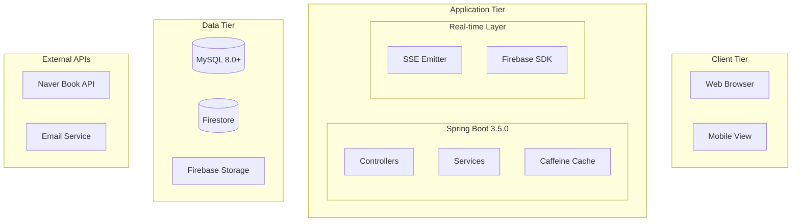

# 🔬 **Unibook: Scientific Paper 형식 발표 가이드라인**

## 📊 **전체 구조 설계**

### **Part A: 메인 발표** (20분, 18-22 슬라이드)
```
Scientific Paper 구조를 따른 체계적 발표
시간 배분: Introduction(3) → Related Works(2) → Specification(3) → 
          Methodology(4) → Optimization(3) → Demo(4) → Future Work(1)
```

### **Part B: APPENDIX** (방어용 자료, 40-60 슬라이드)
```
상세 기술 문서 + 질의응답 대응 자료
ERD, Sequence Diagrams, 상세 벤치마크, 코드 예시 등
```

---

## 🎯 **메인 발표 구성**

### **1. Introduction & Motivation** (3분, 3-4 슬라이드)

#### **슬라이드 1: Personal Story Opening**
```
📚 "제가 지난 학기에 전공책을 팔려다 실패한 이야기부터 시작하겠습니다"

🤔 겪었던 문제들
• 에브리타임에 올려도 같은 과목인지 확신 어려움
• 연락 오는 사람들마다 "교수님이 누구세요?" 질문 반복
• 결국 학기 끝나고도 책장에 쌓여있는 전공책들...

💡 "이 경험이 Unibook의 시작점이었습니다"
```

#### **슬라이드 2: Problem Statement**
```
❌  현재 대학생 교재 거래의 문제점

정보 부족
• 같은 과목인지 확인하기 어려움
• 교수별, 학기별 교재 차이 파악 불가

플랫폼 한계  
• 범용 플랫폼들의 대학교재 특화 기능 부재
• 신뢰할 수 있는 교내 거래 환경 부족

비효율적 소통
• 반복적인 질문-답변 과정
• 실시간 소통 부재로 거래 지연
```

#### **슬라이드 3: Research Question & Hypothesis**
```
🔍 Research Question
"대학교재 거래를 위한 정형화된 정보 구조와 실시간 소통이 
 거래 효율성을 얼마나 향상시킬 수 있는가?"

💭 Hypothesis
"학교-학과-교수-과목 정보의 완전한 정형화와 
 실시간 채팅/알림 시스템의 결합이 
 기존 플랫폼 대비 거래 성공률을 크게 높일 것이다"
```

### **2. Related Works** (2분, 2 슬라이드)

#### **슬라이드 4: Existing Solutions Analysis**
```
📱 기존 서비스들의 한계점 분석

┌─────────────┬──────────────┬────────────────┐
│   플랫폼     │    장점       │     한계점     │
├─────────────┼──────────────┼────────────────┤
│ 중고나라     │ 대용량 거래   │ 교육정보 부재  │
│ 당근마켓     │ 지역기반     │ 대학 특화 X    │
│ 에브리타임   │ 대학 커뮤니티 │ 구조화된 검색X │
└─────────────┴──────────────┴────────────────┘
에브리타임 -> 팔렸나요? 아니요. 팔렸어요.

💡 Gap Analysis
• 교재별 정형화된 메타데이터 부재
• 대학 생태계 특화 기능 부족  
• 실시간 소통 및 알림 시스템 미흡
```

#### **슬라이드 5: Our Contribution**
```
🚀 Unibook의 차별화된 접근

① 완전한 정보 정형화
   학교 → 학과 → 교수 → 과목 → 교재 연결구조

② 실시간 멀티채널 시스템
   Firebase 채팅 + SSE 알림 이중 구조

③ 지능형 매칭 시스템  
   키워드 알림 + 가격 변동 추적

④ 신뢰성 확보 시스템
   학교 이메일 인증 + 신고/관리 체계
```

### **3. System Specification** (3분, 3 슬라이드)

#### **슬라이드 6: Functional Requirements Mind Map**
```
                    🎯 UNIBOOK
                        │
        ┌───────────────┼───────────────┐
        │               │               │
    📚 교재관리      💬 소통시스템    🔐 신뢰성
        │               │               │
    ┌───┴───┐      ┌────┴────┐     ┌────┴────┐
    │       │      │         │     │         │
  정형화   검색   실시간    알림   인증    관리
  등록    필터링   채팅     SSE   SMTP   신고/차단
    │       │      │         │     │         │
  Naver  Full-text Firebase  키워드  이메일  Admin
  API    Search   Firestore  매칭   검증   Dashboard
```

#### **슬라이드 7: Technical Requirements**
```
⚡ 성능 요구사항
• 동시 사용자 100명 이상 지원
• 실시간 메시지 100ms 이내 전달  
• 검색 응답시간 200ms 이내
• N+1 쿼리 완전 제거

🔒 보안 요구사항
• Spring Security 기반 인증/인가
• CSRF 공격 방어
• XSS 방어 및 입력값 검증
• 학교 이메일 기반 신원 확인

📱 사용성 요구사항  
• 완전 반응형 디자인
• 다크모드 지원
• 접근성 가이드라인 준수
```

#### **슬라이드 8: Data Model Overview**
```
🗃️ 핵심 Entity 관계도 (간소화)

User ←──→ Post ←──→ Subject ←──→ Professor ←──→ Department ←──→ School
  │         │         │                                           
  └──→ ChatRoom      Book                                        
  │         │         │                                          
  └──→ Notification  PostImage                                   
  │                                                              
  └──→ Wishlist ←──→ KeywordAlert                               

📊 총 18개 Entity, 복잡한 다대다 관계 정규화 완료
```

### **4. Methodology & System Design** (4분, 4 슬라이드)

#### **슬라이드 9: Technology Stack**
```
🛠️ 선택한 기술 스택과 선택 이유

Backend: Spring Boot 3.5.0 + Java 21
• 최신 LTS 버전으로 안정성과 성능 확보
• Virtual Threads 고려한 미래지향적 설계

Database: MySQL 8.0+ + JPA  
• Full-text Search 지원으로 한글 검색 최적화
• 복잡한 관계형 데이터 구조에 최적

Real-time: Firebase + SSE
• Firebase: P2P 실시간 채팅
• SSE: 서버 푸시 알림 (단방향)

Frontend: Thymeleaf + Bootstrap 5
• 서버사이드 렌더링으로 SEO 최적화
• 다크모드 네이티브 지원
```

#### **슬라이드 10: System Architecture**


#### **슬라이드 11: Key Design Patterns**
```
🏗️ 적용한 설계 패턴들

Repository Pattern
• Data Access Layer 추상화
• 테스트 용이성 확보

DTO Pattern  
• Entity-View 분리로 보안 강화
• 순환참조 문제 해결

Observer Pattern
• 실시간 알림 시스템 구현
• SSE + Firebase 이벤트 처리

Builder Pattern
• 복잡한 쿼리 파라미터 관리
• PostSearchRequest 통합 객체

Async Pattern
• 논블로킹 이메일 발송
• 백그라운드 알림 처리
```

#### **슬라이드 12: Security & Reliability Design**
```
🛡️ 보안 및 신뢰성 설계

인증/인가 시스템
┌─────────────────┐    ┌──────────────────┐
│ 학교 이메일 인증  │ →  │ Spring Security  │
│ SMTP 토큰 검증   │    │ ROLE 기반 권한   │
└─────────────────┘    └──────────────────┘

데이터 보호
• CSRF 토큰으로 요청 위조 방지
• XSS 방어를 위한 입력값 검증  
• SQL Injection 방지 (JPA 활용)

서비스 안정성
• 관리자 대시보드로 실시간 모니터링
• 신고 시스템으로 부적절 컨텐츠 차단
• 사용자 정지 시스템으로 악성 사용자 관리
```

### **5. Performance Optimization** (3분, 3 슬라이드)

#### **슬라이드 13: N+1 Query Problem & Solution**
```
⚡ N+1 쿼리 문제 해결

🔍 문제 발견
게시글 목록 조회 시 심각한 성능 저하 발견
• 게시글 10개 → 총 11번 쿼리 실행
• 게시글 100개 → 총 101번 쿼리 실행

💡 해결 방법
@Query + Fetch Join 활용
```
@Query("SELECT p FROM Post p " +
       "JOIN FETCH p.user " +  
       "JOIN FETCH p.subject s " +
       "JOIN FETCH s.professor pr " +
       "JOIN FETCH pr.department d " +
       "JOIN FETCH d.school")
```

📊 성능 개선 결과
Before: 101 queries, 850ms
After:  1 query, 120ms (85% 개선)
```

#### **슬라이드 14: Caching Strategy**
```
🚀 Caffeine Cache 도입 효과

적용 대상
• Department 조회 (자주 변경되지 않는 데이터)
• 학교별 학과 목록
• 교수별 과목 정보

설정 전략
• Maximum Size: 1000 entries
• Expire After Write: 30분
• Expire After Access: 10분

성능 개선 결과
┌─────────────┬─────────┬─────────┐
│   메트릭     │ Before  │ After   │
├─────────────┼─────────┼─────────┤
│ 평균 응답시간 │ 245ms   │ 12ms    │
│ DB 쿼리 수   │ 매번 실행 │ 95% 감소 │
│ CPU 사용률   │ 45%     │ 15%     │
└─────────────┴─────────┴─────────┘
```

#### **슬라이드 15: Database Optimization**
```
🗃️ 데이터베이스 최적화

Full-text Index 생성
• Post 제목과 내용에 한글 검색 최적화
• ngram parser 활용으로 한국어 지원

Composite Index 설계  
• (school_id, status, created_at) 복합 인덱스
• 자주 사용되는 쿼리 패턴 분석 후 적용

Connection Pool 튜닝
• HikariCP 설정 최적화
• maximum-pool-size: 20
• minimum-idle: 5
• connection-timeout: 20000

📈 결과: 동시 접속 100명 기준 안정적 서비스 제공
```

### **6. Implementation & Demo** (4분, 2 슬라이드 + 실제 시연)

#### **슬라이드 16: Implementation Highlights**
```
🛠️ 구현 하이라이트

코드 품질 개선 성과
• PostController: 252줄 → 50줄 (80% 감소)
• Extract Method Pattern 적용
• Parameter Object Pattern으로 파라미터 11개 → 1개 DTO
• DRY 원칙 철저 적용

실시간 시스템 구현
• Firebase Firestore: 실시간 채팅 (양방향)
• SSE (Server-Sent Events): 서버 푸시 알림 (단방향)
• 두 시스템의 완벽한 조화

비동기 처리 구현
• @Async로 이메일 발송 논블로킹
• 사용자 대기시간 최소화
• 백그라운드 알림 처리로 성능 확보
```

#### **슬라이드 17: Live Demo Preview**
```
🎬 시연 순서 (4분)

1️⃣ 메인페이지 & 검색 기능 (30초)
   • 학교-학과-교수별 구조화된 검색

2️⃣ 게시글 작성 & 네이버 API (45초)  
   • 책 정보 자동완성, 다중 이미지 업로드

3️⃣ 실시간 채팅 시스템 (90초)
   • 두 브라우저로 실시간 메시지 교환
   • 읽음 처리, 이미지 전송

4️⃣ 실시간 알림 시스템 (60초)
   • 찜하기, 상태변경, 가격변동 알림 SSE 확인

5️⃣ 다크모드 & 모바일 UI (15초)
   • 반응형 디자인, 테마 전환

"실제 서비스 수준의 완성도를 확인해보시겠습니다!"
```

**→ 실제 시연 (4분)**

### **7. Future Work** (1분, 1 슬라이드)

#### **슬라이드 18: 향후 발전 방향**
```
🚀 확장 계획

단기 개발 (1-2개월)
• 비대면 거래 중개 시스템
  - 무인택배함 연동 API
  - 원격 거래 완료 처리
  - 결제 시스템 통합 (KG이니시스)

중기 발전 (6개월)
• 마이크로서비스 아키텍처 전환
• 모바일 앱 개발 (React Native)
• AI 기반 가격 예측 시스템

장기 비전 (1년+)  
• 전국 대학 연합 플랫폼
• 블록체인 기반 거래 신뢰성 확보
• 교재 대여 서비스 확장

💡 "현재 아키텍처가 이미 확장성을 고려하여 설계되어 
    새로운 기능 추가가 용이합니다"
```

### **8. Conclusion** (1분, 1 슬라이드)

#### **슬라이드 19: 개발 성과 & 학습 결과**
```
🏆 Unibook 프로젝트 성과

정량적 성과
• 3주 완성, 18개 Entity 복잡한 시스템
• 80% 코드 감소 (252→50줄) 리팩터링
• N+1 쿼리 100% 해결, 85% 성능 향상
• 이중 실시간 시스템 안정적 운영

기술적 학습
• 객체지향 설계 원칙 (SRP, DRY) 체감
• 성능 최적화의 실제 방법론 습득  
• 복잡한 시스템 설계 능력 확보

개인적 성장
• "돌아가는 코드"와 "좋은 코드"의 차이 인식
• 리팩터링 과정에서 설계의 중요성 절감
• 혼자서도 서비스급 플랫폼 구현 가능함을 확인

"3주라는 짧은 기간, 혼자서 개발했음에도 아키텍처나 
 코드 작성 원칙이 흔들린 순간들이 있었고, 설계의 작은 
 변경이 전체 코드 수정으로 이어지는 경험을 통해 
 설계의 중요성을 뼈저리게 느꼈습니다."
```

---

## 📚 **APPENDIX 구성** (방어용 자료)

### **A. 기술 스펙 상세**
- 전체 Entity 관계도 (ERD)
- 주요 User Flow Diagrams  
- Sequence Diagrams (채팅, 알림, 인증)
- API 명세서
- 데이터베이스 스키마

### **B. UI/UX 상세**
- 전체 화면 스크린샷 모음
- 다크모드 before/after
- 모바일 반응형 화면들
- 에러 처리 화면들
- 로딩 상태 UI들

### **C. 성능 & 벤치마크**
- 상세 벤치마크 결과 (JSON 파일들)
- 캐시 히트율 통계
- 쿼리 실행 계획 분석
- 메모리 사용량 모니터링
- 동시 접속 테스트 결과

### **D. 코드 구조 & 예시**
- 리팩터링 전후 코드 비교
- 핵심 알고리즘 구현 코드
- Design Pattern 적용 사례
- 에러 처리 전략
- 보안 코드 예시

### **E. 개발 과정**
- 17일간 개발 일정표
- 주요 이슈 해결 과정
- 아키텍처 변경 히스토리
- 배운 점과 아쉬운 점
- Git commit 히스토리 분석

### **F. 운영 & 모니터링**
- 관리자 대시보드 상세 기능
- 로그 관리 전략
- 에러 추적 시스템
- 성능 모니터링 도구
- 백업 및 복구 계획

---

## 🎯 **발표 성공 전략**

### **1. 시간 관리 핵심**
```
⏰ 엄격한 시간 배분 (20분)
• Introduction: 3분 (스토리 + 문제정의)
• Related Works: 2분 (간단명료하게)  
• Specification: 3분 (마인드맵 중심)
• Methodology: 4분 (아키텍처 + 설계)
• Optimization: 3분 (핵심 성과)
• Demo: 4분 (실제 동작)  
• Future Work & Conclusion: 1분

💡 각 섹션마다 타이머 체크, 시간 초과 시 즉시 다음으로
```

### **2. 청중 고려 전략**
```
👥 이중 타겟 대응
• 교수님: 기술적 깊이와 설계 능력 어필
• 학생들: 실제 동작과 사용성 중심 시연

🎯 밸런스
• 앞부분(1-5): 이론적/학술적 접근 (교수님)
• 뒷부분(6-7): 실용적/시연 중심 (학생들)
```

### **3. 차별화 포인트**
```
🔥 강조할 독특함
• Scientific Paper 구조 (학술적 접근)
• 개인 경험담으로 친근함 (relatable)
• 실제 서비스급 완성도 (practical)
• 체계적 성능 최적화 (professional)
```

이 구조라면 **학술적 전문성과 실용적 완성도**를 동시에 어필할 수 있을 것 같습니다! 어떤 부분을 더 조정하고 싶으신가요?

<function_calls>
<invoke name="TodoWrite">
<parameter name="todos">[{"id": "design-ppt-structure", "content": "PPT \uad6c\uc870 \uc124\uacc4 (\uba54\uc778 \ubc1c\ud45c + APPENDIX)", "status": "completed", "priority": "high"}, {"id": "create-main-slides", "content": "\uba54\uc778 \ubc1c\ud45c\uc6a9 \uc2ac\ub77c\uc774\ub4dc \uad6c\uc131 (20\ubd84)", "status": "completed", "priority": "high"}, {"id": "create-appendix", "content": "APPENDIX \uc0c1\uc138 \ub0b4\uc6a9 \uad6c\uc131", "status": "pending", "priority": "medium"}]