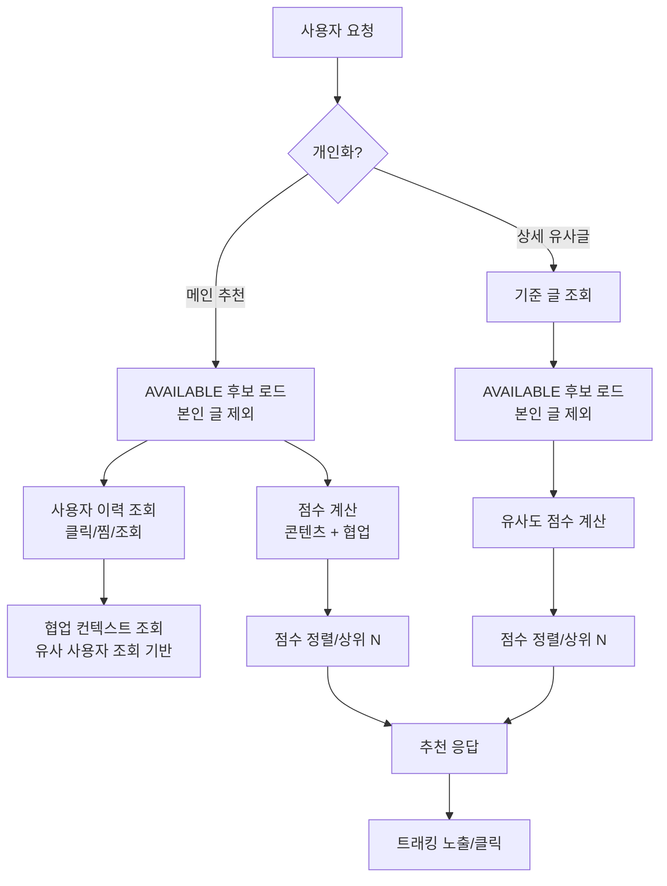

## 추천 시스템 동작 정리

### 설정 (기본값)
- `recommendation.recency-days = 30`
- 행동 가중치: 클릭 1.0, 찜 0.7, 조회 0.3 (`InteractionWeight`)
- 시간 감쇠: `lambda = 0.1`, `decay-threshold-days = 7`
- 유사도 가중치: ISBN 0.50, 과목 0.25, 학과 0.15, 유사도 최신성 0.10
- 콘텐츠 최신성 보정: `content-recency-boost-weight = 0.10`
- 협업 후보 조회 상한: `collaborative-candidate-limit = 50`
- 사용자 이력 조회 상한: 클릭 20, 찜 15, 조회 30 (`max-*-to-fetch`)
- 적응형 가중치
  - 기본: 콘텐츠 0.90 / 협업 0.10
  - 중간: 콘텐츠 0.70 / 협업 0.30
  - 균형: 콘텐츠 0.50 / 협업 0.50
  - 전환 임계값: `min-user-views = 10`, `min-total-views = 1000`, 중간→균형 임계값 `30 / 5000`

### 파이프라인 개요

### 수식
- **시간 감쇠** (클릭만 적용):  
  $$w_{\text{decay}} = w \times e^{-\lambda \max(0, d - d_0)}$$  
  \(w\): 행동 가중치, \(d\): 경과일, \(d_0\): 감쇠 시작 임계값

- **유사도 점수** (\(0 \sim 1\))  
  $$S_{\text{sim}} = 1_{\text{ISBN}} \cdot w_{\text{isbn}} + 1_{\text{subject}} \cdot w_{\text{subj}} + 1_{\text{dept}} \cdot w_{\text{dept}} + R(p) \cdot w_{\text{recency}}$$  
  \(R(p) = \max(0, 1 - \frac{\text{age}(p)}{\text{recency-days}})\)

- **콘텐츠 점수** (\(0 \sim 1\))  
  상호작용별 유사도 가중 평균 후 최신성 보정:  
  $$S_{\text{content}} = \frac{\sum_i S_{\text{sim}}(i,p) \cdot w_i}{\sum_i w_i} + R(p) \cdot w_{\text{content-recency}}$$  
  이력 없으면 0.5 기본값.

- **협업 점수** (\(0 \sim 1\))  
  $$S_{\text{collab}} = \frac{\text{views}(p)}{\max\_v \text{views}(v)}$$  
  `findCollaborativePostsByUserId` 결과 맵을 1회 생성 후 O(1) 조회.

- **최종 점수**  
  $$S_{\text{final}} = \alpha \cdot S_{\text{content}} + \beta \cdot S_{\text{collab}}$$  
  \(\alpha,\beta\)는 적응형 가중치(기본/중간/균형)로 설정에서 주입.

- **유사글 점수**  
  개인화 없이 \(S_{\text{sim}}\)만 계산해 상위 N을 반환(0 이하 점수는 제외).

- **CTR**  
  $$\text{CTR}(\%) = \frac{\text{clicks}}{\text{impressions}} \times 100$$

### 데이터 흐름
- 후보: `postRepository.findByStatus(AVAILABLE)` 전수 로드 후 필터링(본인 제외) → 향후 슬롯/샘플링 개선 여지.
- 사용자 이력: 클릭/찜/조회 각각 제한 개수만 조회 (`max-clicks/wishlists/views-to-fetch`).
- 협업 컨텍스트: 조회 기반 유사 사용자 쿼리 결과를 맵으로 캐싱 후 재사용(쿼리 1회).
- 최신성: `recency-days` 선형 감소로 `content` 보정 + 유사도에 가중치로 추가.

### 트래킹/메트릭
- 노출: `/api/recommendations/track-impression` (세션+타입, 5분 중복 방지).
- 클릭: `/api/recommendations/track-click` (sendBeacon → keepalive fetch 폴백).
- 메트릭: 타입별 클릭/노출 합계, CTR, 일별 통계, 타입별 통계(노출 합 포함) → 관리자 대시보드 렌더링.

### 주석/안전망
- 설정 기본값은 기존 상수와 동일하게 두어 동작 회귀 없음.
- 협업 컨텍스트·이력 조회 실패 시 0점/빈 리스트로 폴백.
- 중복 쿼리 제거: 협업 후보는 1회 조회 후 맵 재사용.
