# 🛡️ Unibook 접근통제 로직 순서도

## 📋 목차
1. [AuthorizationService 핵심 메서드](#authorizationservice-핵심-메서드)
2. [게시글 상세 조회 권한](#게시글-상세-조회-권한)
3. [게시글 수정 권한](#게시글-수정-권한)
4. [게시글 삭제 권한](#게시글-삭제-권한)
5. [게시글 상태 변경 권한](#게시글-상태-변경-권한)
6. [관리자 전용 기능](#관리자-전용-기능)

---

## AuthorizationService 핵심 메서드

### 🔍 isOwner() 메서드
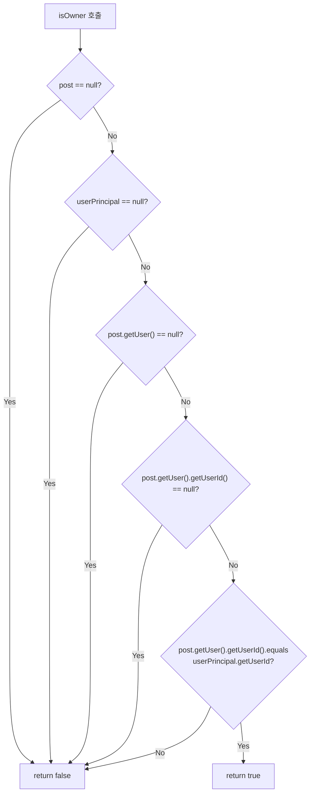

### 🔍 isAdmin() 메서드
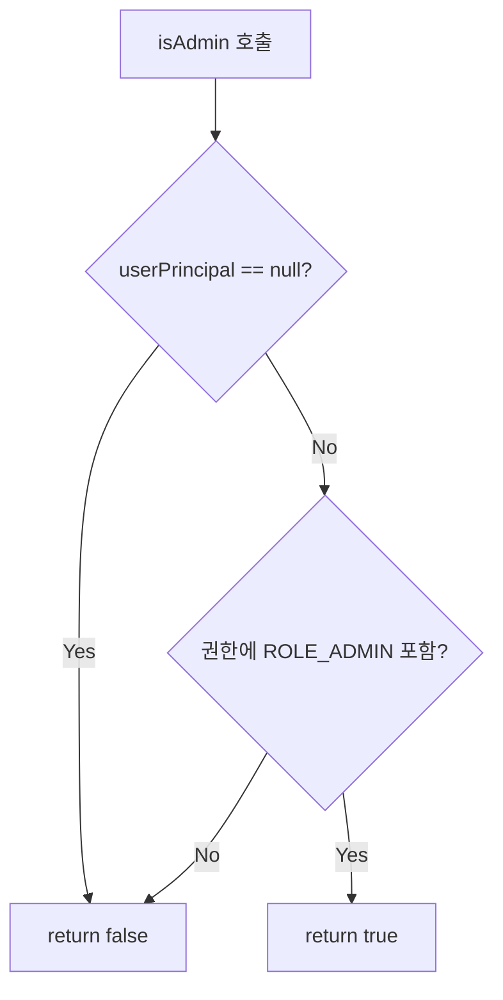

### 🔍 canEdit() 메서드 (핵심 로직)
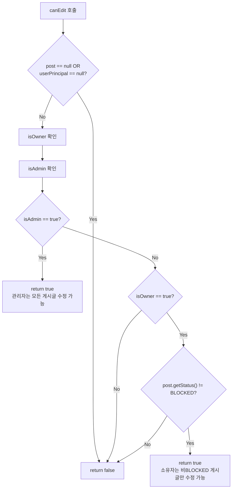

---

## 게시글 상세 조회 권한

### 📖 GET /posts/{id} - 전체 흐름
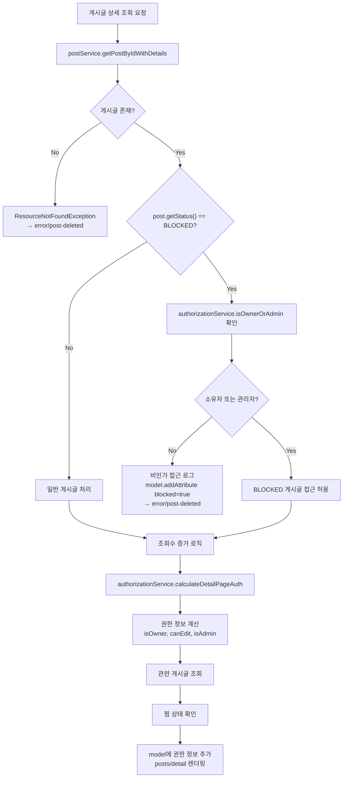

### 📖 calculateDetailPageAuth() 상세 로직
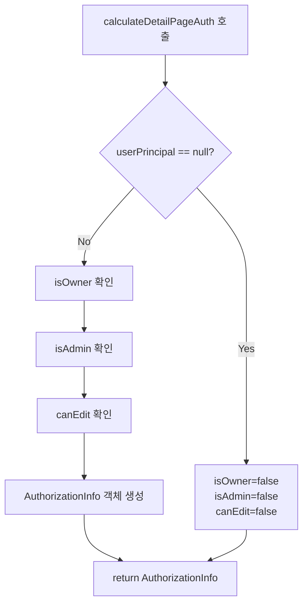

---

## 게시글 수정 권한

### ✏️ GET /posts/{id}/edit - 수정 폼 접근
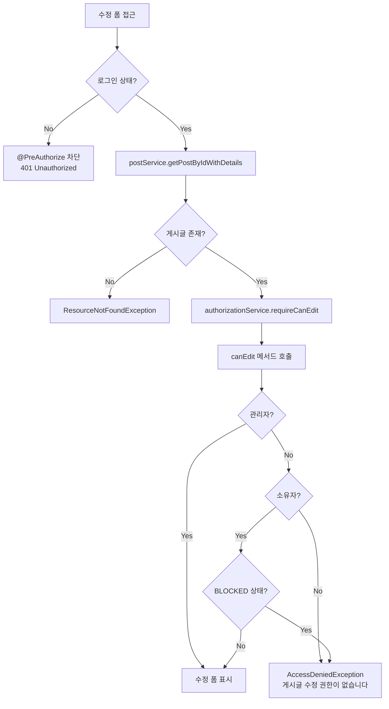

### ✏️ POST /posts/{id}/edit - 수정 처리
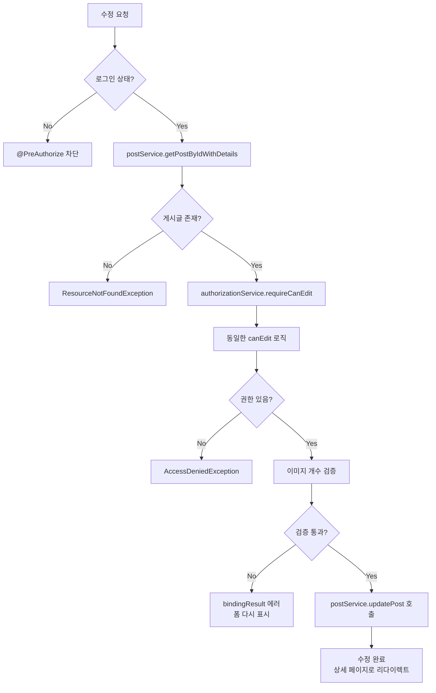

---

## 게시글 삭제 권한

### 🗑️ POST /posts/{id}/delete
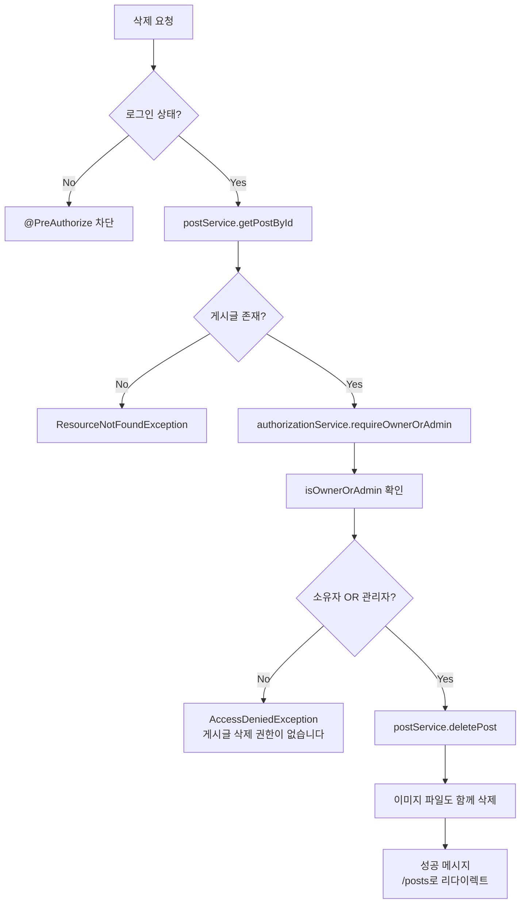

### 🔍 requireOwnerOrAdmin() 상세 로직
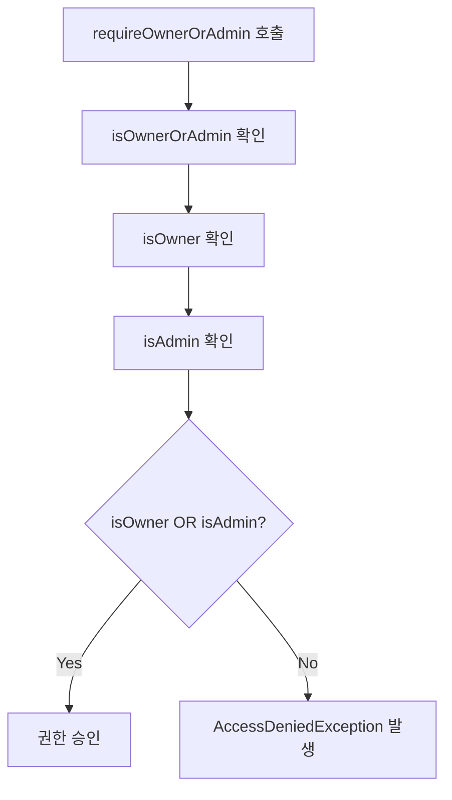

---

## 게시글 상태 변경 권한

### 🔄 POST /posts/{id}/status - 상태 변경 (AJAX)
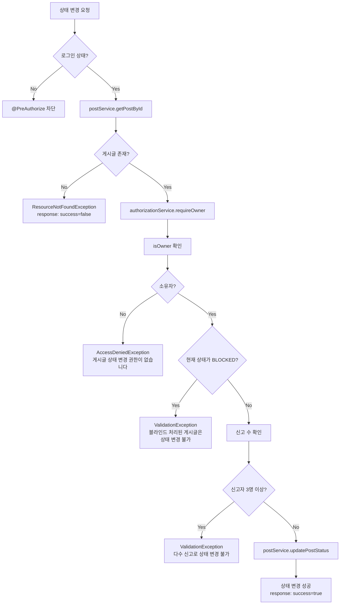

### ⚠️ 중요한 제약 사항
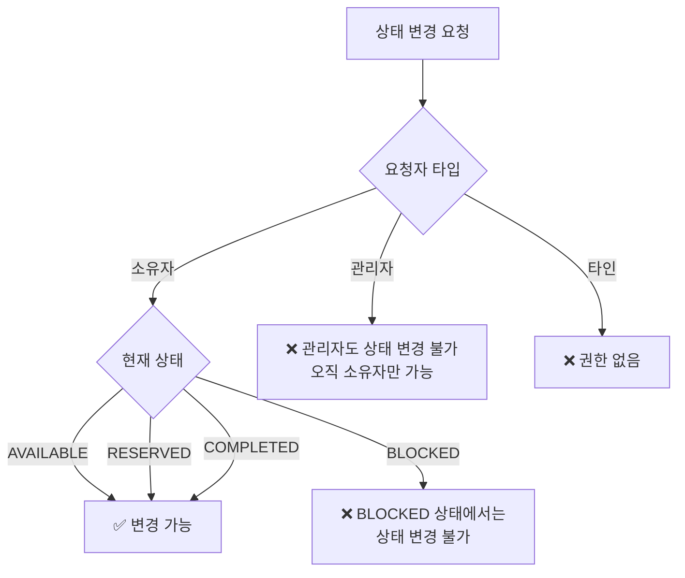

---

## 관리자 전용 기능

### 🔒 PUT /posts/{id}/block - 게시글 차단
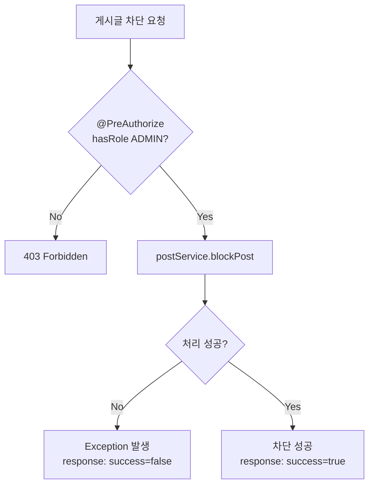

### 🔓 PUT /posts/{id}/unblock - 게시글 차단 해제
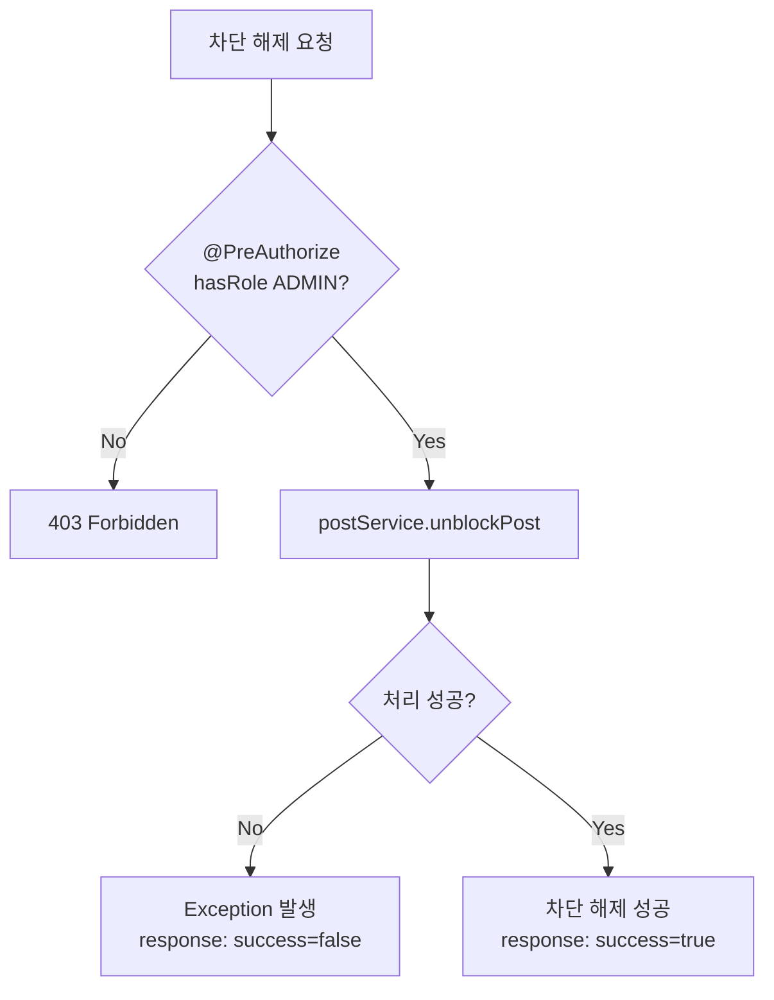

---

## 🎯 핵심 보안 규칙 요약

### 📊 권한 매트릭스
| 기능 | 게시글 소유자 | 관리자 | 타인 | 비로그인 |
|------|---------------|--------|------|----------|
| **일반 게시글 조회** | ✅ | ✅ | ✅ | ✅ |
| **BLOCKED 게시글 조회** | ✅ | ✅ | ❌ | ❌ |
| **일반 게시글 수정** | ✅ | ✅ | ❌ | ❌ |
| **BLOCKED 게시글 수정** | ❌ | ✅ | ❌ | ❌ |
| **게시글 삭제** | ✅ | ✅ | ❌ | ❌ |
| **게시글 상태 변경** | ✅* | ❌ | ❌ | ❌ |
| **게시글 차단/해제** | ❌ | ✅ | ❌ | ❌ |

*\* BLOCKED 상태이거나 신고 3회 이상인 경우 불가*

### 🚨 중요한 보안 포인트

1. **BLOCKED 게시글 보안**:
   - 소유자도 수정 불가 (관리자만 가능)
   - 소유자도 상태 변경 불가
   - 비소유자는 조회도 불가

2. **상태 변경 제한**:
   - 관리자도 상태 변경 불가 (오직 소유자만)
   - BLOCKED 상태에서는 어떤 상태로도 변경 불가
   - 신고 3회 이상 시 상태 변경 차단

3. **Null 안전성**:
   - 모든 권한 체크에서 null 체크 수행
   - UserPrincipal, Post, User 모두 null 안전

4. **예외 처리**:
   - 권한 없음: `AccessDeniedException`
   - 리소스 없음: `ResourceNotFoundException`  
   - 검증 실패: `ValidationException`

이 순서도를 통해 Unibook의 모든 접근통제 로직을 한눈에 파악할 수 있습니다. 🛡️