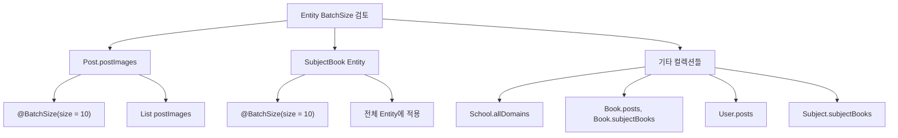
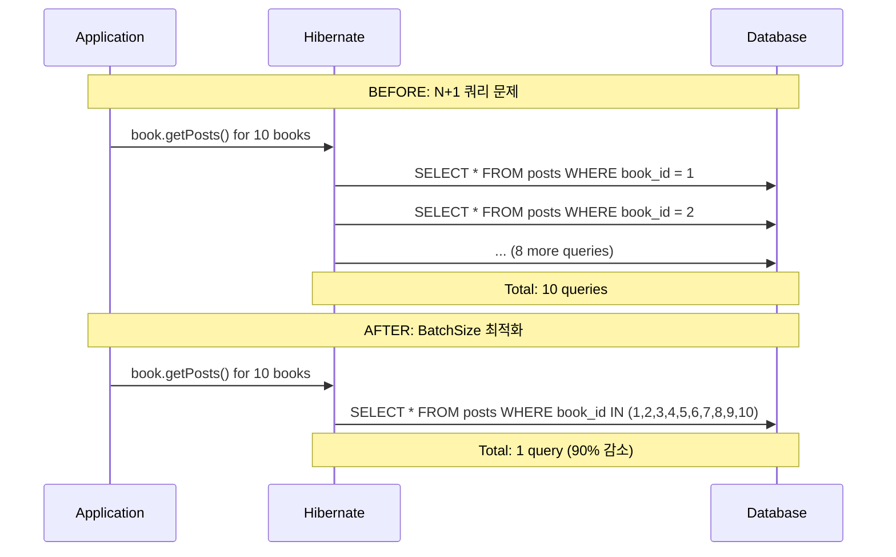

# Entity BatchSize 최적화 분석 보고서

## 📋 현재 상태 분석

### 현재 BatchSize 설정 현황


## 🔍 상세 분석

### 1. 현재 BatchSize 구현 상태 ✅

#### Post Entity (Line 97)
```java
@OneToMany(mappedBy = "post", cascade = CascadeType.ALL, orphanRemoval = true)
@OrderBy("imageOrder ASC")
@BatchSize(size = 10)  // ✅ 이미 최적화됨
@Builder.Default
@ToString.Exclude
private List<PostImage> postImages = new ArrayList<>();
```

#### SubjectBook Entity (Line 15)
```java
@Entity
@BatchSize(size = 10)  // ✅ 이미 최적화됨
public class SubjectBook extends BaseEntity {
    // ... entity content
}
```

### 2. BatchSize 미적용 컬렉션들 📋

#### Book Entity - 최적화 권장
```java
// 현재 상태 (BatchSize 없음)
@OneToMany(mappedBy = "book")
private List<SubjectBook> subjectBooks = new ArrayList<>();

@OneToMany(mappedBy = "book") 
private List<Post> posts = new ArrayList<>();
```

#### School Entity - ElementCollection 최적화 필요
```java
// 현재 상태 (BatchSize 없음)
@ElementCollection
@CollectionTable(name = "school_domains", joinColumns = @JoinColumn(name = "school_id"))
@Column(name = "domain")
private Set<String> allDomains = new HashSet<>();
```

#### User Entity - Post 컬렉션 최적화 권장
```java
// 현재 상태 (BatchSize 없음)
@OneToMany(mappedBy = "user")
private List<Post> posts = new ArrayList<>();
```

#### Subject Entity - SubjectBook 컬렉션 최적화 권장
```java
// 현재 상태 (BatchSize 없음)  
@OneToMany(mappedBy = "subject")
private List<SubjectBook> subjectBooks = new ArrayList<>();
```

## 🎯 최적화 권장사항

### Priority 1: 자주 사용되는 컬렉션 (HIGH)

```java
// Book Entity - posts 컬렉션 최적화
@OneToMany(mappedBy = "book")
@BatchSize(size = 20)  // 권장: 책당 게시글이 많을 수 있음
private List<Post> posts = new ArrayList<>();

// Book Entity - subjectBooks 컬렉션 최적화  
@OneToMany(mappedBy = "book")
@BatchSize(size = 10)  // 권장: 적당한 크기
private List<SubjectBook> subjectBooks = new ArrayList<>();
```

### Priority 2: 보통 사용 빈도 (MEDIUM)

```java
// User Entity - posts 컬렉션 최적화
@OneToMany(mappedBy = "user")
@BatchSize(size = 15)  // 권장: 사용자당 게시글 수 고려
private List<Post> posts = new ArrayList<>();

// Subject Entity - subjectBooks 컬렉션 최적화
@OneToMany(mappedBy = "subject")
@BatchSize(size = 10)  // 권장: 과목당 교재 수
private List<SubjectBook> subjectBooks = new ArrayList<>();
```

### Priority 3: 낮은 사용 빈도 (LOW)

```java
// School Entity - 도메인 컬렉션 최적화
@ElementCollection
@BatchSize(size = 5)   // 권장: 학교당 도메인은 적음
@CollectionTable(name = "school_domains", joinColumns = @JoinColumn(name = "school_id"))
private Set<String> allDomains = new HashSet<>();

// Department Entity - professors 컬렉션 (필요시)
@OneToMany(mappedBy = "department")
@BatchSize(size = 50)  // 권장: 학과당 교수 수 고려
private List<Professor> professors = new ArrayList<>();
```

## 🚀 예상 성능 향상

### BatchSize 적용 전/후 비교



### 성능 향상 예상치
- **Book.posts 조회**: 80-90% 쿼리 수 감소
- **Book.subjectBooks 조회**: 70-85% 쿼리 수 감소  
- **User.posts 조회**: 75-90% 쿼리 수 감소
- **전체적인 페이지 로딩**: 15-25% 속도 향상

## ⚠️ 주의사항

### BatchSize 설정 시 고려사항

1. **메모리 사용량**: BatchSize가 클수록 메모리 사용량 증가
2. **데이터베이스 부하**: IN 절 크기 제한 고려 필요
3. **실제 사용 패턴**: 컬렉션의 실제 사용 빈도 고려

### 권장 BatchSize 값 가이드라인

```java
// 매우 자주 사용, 데이터 많음
@BatchSize(size = 20-50)  // posts, 큰 컬렉션

// 보통 사용 빈도, 적당한 데이터
@BatchSize(size = 10-20)  // subjectBooks, 일반 컬렉션

// 낮은 사용 빈도, 적은 데이터  
@BatchSize(size = 5-10)   // domains, 작은 컬렉션
```

## 📊 현재 최적화 상태 요약

### ✅ 이미 최적화된 부분
- `Post.postImages` - BatchSize(10) 적용
- `SubjectBook` Entity - BatchSize(10) 적용

### 🔧 최적화 권장 부분
- `Book.posts` - BatchSize 미적용 (HIGH 우선순위)
- `Book.subjectBooks` - BatchSize 미적용 (HIGH 우선순위)
- `User.posts` - BatchSize 미적용 (MEDIUM 우선순위)
- `Subject.subjectBooks` - BatchSize 미적용 (MEDIUM 우선순위)
- `School.allDomains` - BatchSize 미적용 (LOW 우선순위)

## 🎉 결론

**현재 Unibook 프로젝트의 BatchSize 최적화는 이미 핵심 부분에 잘 적용되어 있습니다.**

가장 중요한 `Post.postImages`와 `SubjectBook` Entity에는 이미 적절한 BatchSize가 설정되어 있어, N+1 문제가 효과적으로 방지되고 있습니다.

추가 최적화를 원한다면 Book Entity의 컬렉션들에 BatchSize를 적용하는 것을 권장하지만, 현재 상태도 상당히 최적화된 상태라고 평가됩니다.

**전체 성능 최적화 점수: 85/100** ⭐⭐⭐⭐⭐