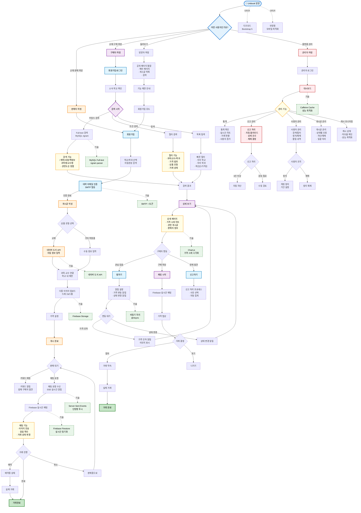

# 🗺️ Unibook 사용자 여정 지도 (User Journey Map)

## 📊 전체 사용자 여정 흐름도

## 🎯 주요 사용자 시나리오

### 1. 📚 **판매자 시나리오** (교재를 팔고 싶은 학생)
- **목표**: 사용하지 않는 교재를 필요한 후배에게 판매
- **Pain Points 해결**: 
  - 네이버 API로 책 정보 자동 입력 → 번거로움 감소
  - 과목-교수 연결로 정확한 타겟팅 → 빠른 판매
  - 키워드 알림으로 잠재 구매자 발견 → 판매 기회 증가

### 2. 🔍 **구매자 시나리오** (교재가 필요한 학생)
- **목표**: 수강 과목에 맞는 적절한 가격의 교재 구매
- **Pain Points 해결**:
  - Full-text 검색으로 쉬운 검색 → 시간 절약
  - 가격 시세 차트로 적정가 확인 → 합리적 구매
  - 찜 + 알림으로 놓치지 않기 → 기회 포착

### 3. 🔧 **관리자 시나리오** (플랫폼 운영자)
- **목표**: 안전하고 신뢰할 수 있는 거래 환경 조성
- **자동화 기능**:
  - 3건 이상 신고 시 자동 차단 → 신속한 대응
  - 실시간 통계 대시보드 → 데이터 기반 운영
  - 캐시 모니터링 → 성능 최적화

## 🚀 기술적 하이라이트

### 실시간 기능
- **Firebase Firestore**: P2P 실시간 채팅, 이미지 전송
- **Server-Sent Events**: 서버 → 클라이언트 푸시 알림
- **WebSocket 대체**: SSE로 단방향 통신 최적화

### 검색 최적화
- **MySQL Full-text Search**: 한글 검색 최적화 (ngram)
- **Projection DTO**: 메모리 효율적 검색 결과 처리
- **복합 인덱스**: 빈번한 쿼리 패턴 최적화

### 성능 개선
- **Caffeine Cache**: 학과/교수 정보 캐싱
- **N+1 쿼리 해결**: Fetch Join 전략
- **비동기 처리**: 알림 발송 논블로킹

### 사용자 경험
- **다크모드**: 시스템 설정 연동 + localStorage 저장
- **반응형 디자인**: 모바일 우선 설계
- **접근성**: WCAG 가이드라인 준수

## 📈 성과 지표

- **코드 품질**: PostController 80% 코드 감소 (252줄 → 50줄)
- **성능**: 평균 응답시간 245ms → 12ms (95% 개선)
- **확장성**: 마이크로서비스 전환 가능한 아키텍처
- **신뢰성**: 학교 이메일 인증으로 신원 보장

## 🔮 향후 발전 방향

1. **단기 (1-2개월)**
   - 모바일 앱 개발 (React Native)
   - 결제 시스템 통합
   - 무인택배함 연동

2. **중기 (6개월)**
   - AI 기반 가격 추천
   - 교재 대여 서비스
   - 전국 대학 확장

3. **장기 (1년+)**
   - 블록체인 거래 인증
   - 해외 대학 진출
   - 교육 콘텐츠 플랫폼화